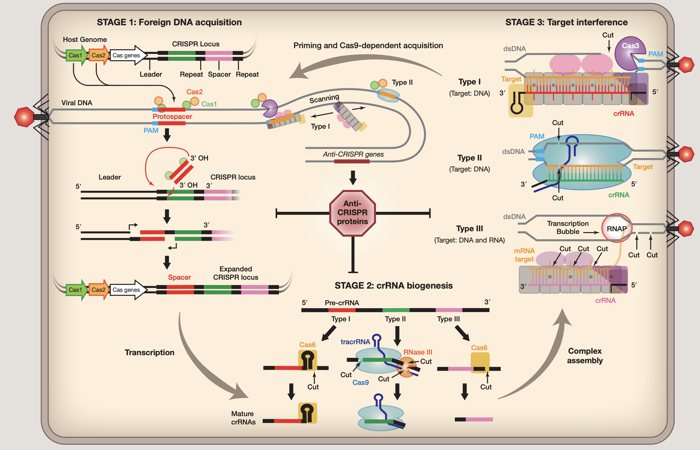

## Introduction

CRISPR规律成簇间隔短回文重复：clustered regularly interspaced short
palindromic repeats

CRISPR是存在于细菌基因组中的一种元件，其中含有曾经攻击过该细菌的病毒的基因片段。细菌透过这些基因片段来侦测并抵抗相同病毒的攻击，并摧毁其DNA，这类基因组是细菌（和古菌）免疫系统的关键组成部分。

### Work mechanism

CRISPR整体工作流程基本如下 ([*1*](#ref-carterSnapShotCRISPRRNAGuidedAdaptive2015))：

阶段1. 外源DNA采集

外来核酸被Cas蛋白识别，入侵DNA的短片段（30-50个碱基对）（称为原型间隔子）被插入宿主的CRISPR基因座作为间隔序列，由重复序列分隔。在I型和II型系统中，原型间隔子选自侧翼有2-5称为PAM（protospacer
adjacent
motif）的核苷酸(nt)基序。原型间隔子通常结合在CRISPR基因座的一端，称为领导者，通过涉及Cas1、Cas2和原型间隔子上的游离3’羟基的机制。Protospacer整合伴随着重复前导末端重复序列，可能涉及宿主聚合酶和DNA修复机制。

阶段2. crRNA生物合成

CRISPR
RNA生物合成始于转录，然后将初级转录本（pre-crRNA）核解加工成短的CRISPR衍生RNA文库(crRNAs)，每个都包含与先前遇到的外来DNA互补的序列。crRNA指导序列的两侧是相邻重复区域。在I型和III型系统中，初级CRISPR转录物由在重复序列内切割的CRISPR特异性内切核糖核酸酶（Cas6或Cas5d）处理。在许多I型系统中，重复序列是回文序列，并且Cas6与crRNA3’端的茎环稳定相关。在III型系统中，Cas6与CRISPR
RNA瞬时结合，crRNA的3’端被未知核酸酶进一步修剪。CRISPR
RNA加工类型II系统依赖于反式作用crRNA(tracrRNA)，它包含与重复序列互补的序列。这些双链区域在Cas9存在的情况下由RNase
III处理。在II型系统中，tracrRNA和crRNA都是目标干扰所需的。该系统的两个RNA已融合成一个单向导RNA(sgRNA)，Cas9已成为一个强大的工具用于在多种细胞类型和多细胞生物中进行靶向基因组工程。

阶段3. 目标干扰

成熟的crRNA将Cas蛋白引导至互补目标。目标序列被专用Cas核酸酶降解，但目标降解的机制多种多样。I型和II型系统均以包含PAM和互补原型间隔子的dsDNA底物为目标顺序。II型系统中的目标切割由单个蛋白质(Cas9)和两个RNA执行，而I型系统依赖于多亚基监视复合物结合dsDNA底物然后募集Cas3，这是一种反式作用核酸酶，通常与ATP依赖性解旋酶融合。像I型系统，III型系统还依赖多亚基复合物进行目标检测，但与I型系统不同，这些复合物表现出内源性核酸酶活性，以转录依赖性方式降解互补RNA和靶DNA。III型系统不依赖PAM进行目标识别；相反，碱基配对延伸超出指导序列并进入crRNA信号”自身”的5’句柄（CRISPR基因座包含与指导和5’互补的序列handle)并防止目标切割。

### PAM

使用CRISPR/Cas9系统进行基因编辑时需要考虑PAM，PAM的含义和重要性：

1.  Protospacer adjacent motif（PAM）原间隔序列邻近模块序列。

2.  CRISPR/Cas9 (或 gRNA)所靶向的 DNA 序列称为 protospacer，PAM
    是与之紧邻的一小段 DNA 序列(常用的 SpCas9 识别的 PAM 为 NGG)。

3.  Cas9/sgRNA 不能结合、切割没有 PAM 的靶向序列。

4.  PAM 是细菌区分自身 DNA 与外源 DNA 的重要标志。

5.  改变 PAM 或与其相邻的 protospacer/target DNA
    序列会严重影响核酸酶(Cas9, Cpf1 等) 对 DNA 的切割效率。

6.  某些基因编辑操作(如敲入点突变)可能需要人为将 PAM 或与其相邻的 DNA
    序列进行突变，以避免核酸酶对该位点的反复切割，从而提高编辑效率。

### Class, Type, Subtype

<table>
<tr>
<td>

 1类

</td>
<td>

 2类

</td>
</tr>
</table>

原核生物的CRISPR-Cas适应性免疫系统根据效应子模块组织分为两个不同的类别。
1类CRISPR-Cas系统利用**多蛋白效应复合物** ([*2*](#ref-makarovaSnapShotClassCRISPRCas2017))，而2类CRISPR-Cas系统利用**单一蛋白效应器** ([*3*](#ref-makarovaSnapShotClassCRISPRCas2017a))。

基于不同的效应蛋白家族，1类系统分为3种类型和12种亚型。1类系统代表CRISPR-Cas基因座的约90％，并且存在于不同的细菌和古菌门中;嗜热菌富含III型系统。除效应子基因之外，大部分1类基因座编码适应模块蛋白质Cas1和Cas2，以及多种辅助蛋白质，例如Cas4，逆转录酶，CARF（CRISPR相关的Rossmann折叠）结构域蛋白质等。
III型和IV型系统在其各自的基因座中经常缺少适应性模块基因和/或CRISPR阵列。所有I型系统也编码DNA解旋酶Cas3，其通常与HD家族核酸酶结构域融合。在I型系统中，PAM在不同亚型之间变化，位于（原型）间隔区的5’或3’，对于适应和干扰都是必需的。

基于不同的效应蛋白家族，第2类系统可分为3种类型和9个亚型。第十亚型（V-U）包括许多假定的系统，其免疫（或可能是调节）功能仍有待证明。 2类系统占CRISPR-Cas基因座的约10％，在不同的细菌被发现，但在古细菌中几乎不存在。除了效应器蛋白质，大部分2类基因组编码适应性模块蛋白质，Cas1和Cas2以及辅助蛋白质，例如Cas4。 II型和V-B型基因座还包括tracrRNA（反式激活CRISPR RNA），其与重复部分互补并涉及CRISPR（cr）RNA加工和干扰。然而，某些2类系统，特别是类型6的系统仅由CRISPR阵列和效应蛋白组成。

## Reference

1. J. Carter, B. Wiedenheft, [SnapShot: CRISPR-RNA-Guided Adaptive Immune Systems](https://doi.org/10.1016/j.cell.2015.09.011). *Cell*. **163**, 260–260.e1 (2015).

2. K. S. Makarova, F. Zhang, E. V. Koonin, [SnapShot: Class 1 CRISPR-Cas Systems](https://doi.org/10.1016/j.cell.2017.02.018). *Cell*. **168**, 946–946.e1 (2017).

3. K. S. Makarova, F. Zhang, E. V. Koonin, [SnapShot: Class 2 CRISPR-Cas Systems](https://doi.org/10.1016/j.cell.2016.12.038). *Cell*. **168**, 328–328.e1 (2017).

