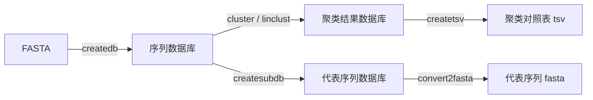

## 为什么需要 MMseqs2


做宏基因组组装时，每个样本会得到几万到几百万条基因（ORF）。不同样本之间、同一组装内部都存在大量高度相似的冗余序列（同源基因、菌株间等位基因、不同 contig 上的重复拷贝）。直接拿这些冗余基因去做下游分析，会造成两方面的偏差：

1. **统计偏差**：冗余序列在丰度统计中被重复计数，高丰度物种被进一步放大；
2. **计算浪费**：注释、比对、功能富集的耗时与基因数近似线性相关。

因此第一步通常是**构建非冗余基因集（non-redundant gene catalog）**。历史上最常用的是 **CD-HIT**，但在序列量级上升到百万级之后，CD-HIT 开始明显吃力。

我当时的实际场景是单样本 80 万条基因、按 90% 相似度去冗余，结果 CD-HIT **跑了两个小时还在处理第 20000 条**。这才有了这篇记录的由来。

### 候选工具

| 工具 | 算法 | 特点 |
|------|------|------|
| CD-HIT | 贪心增量聚类 | 经典、易用、内存可控；大数据的短板明显 |
| UCLUST | 贪心 | CD-HIT 的变体，速度更快 |
| VSEARCH | 贪心 | 比 CD-HIT 快，支持多线程 |
| **MMseqs2** | k-mer 预过滤 + 预计算比对 | 比 CD-HIT / UCLUST 都快，支持多线程与 GPU |
| Swarm | 基于聚类半径 | 适合 16S 等高度冗余序列 |

**MMseqs2**（[GitHub](https://github.com/soedinglab/MMseqs2)）是 2018 年发表在 *Nature Communications* 的工作，核心创新是用 **k-mer 组成的"图像"预过滤**（prefilter）代替逐条两两比对，把海量比对问题压缩到可算的规模。这一篇的评测是它被广泛采用的主要原因之一。

## 安装

推荐用 conda 安装：

```bash
conda create -n mmseqs -c conda-forge -c bioconda mmseqs2
conda activate mmseqs
mmseqs --version
```

也可以直接下载预编译的静态二进制，或用容器：

```bash
singularity pull mmseqs2.sif docker://ghcr.io/soedinglab/mmseqs2
```

## 核心概念：一切皆"数据库"

MMseqs2 与 CD-HIT 最大的使用差异在于：**它不直接吃 FASTA，而是先把 FASTA 导入成自己的数据库格式**。

```bash
mmseqs createdb input.fa db
```

`createdb` 会把序列转成 `db` + `db.index` 等文件。之后所有的操作（搜索、聚类、取子集）都在数据库上做，这也是它快的原因之一——序列数据被索引过，后续可复用。

因此 MMseqs2 的常规流程是：



## 基础用法：单文件聚类

以下命令来自我当时的实测（80 万条基因，90% 相似度）。

### 1. 建库并聚类

```bash
input_fa=../prodigal/C1.gene.fa
DB=C1.geneDB
DB_clu=mmseq_out

mmseqs createdb $input_fa $DB

# 聚类：--min-seq-id 相似度阈值，-c 覆盖度阈值
mmseqs cluster $DB $DB_clu tmp \
    --min-seq-id 0.9 -c 0.9 --cov-mode 1 --threads 8
```

参数说明：

- `--min-seq-id 0.9`：序列一致性阈值，对应 CD-HIT 的 `-c 0.9`；
- `-c 0.9`：比对覆盖度阈值（较短序列被较长序列覆盖的比例）；
- `--cov-mode 1`：覆盖度的计算方式（1 = 以 target 为分母）；
- `--threads 8`：线程数；
- `tmp`：临时目录，**必须显式给出**，且注意它的磁盘占用。

### 2. 提取代表序列

```bash
# 从聚类结果里挑出代表序列
mmseqs createsubdb $DB_clu $DB ${DB_clu}_rep
mmseqs convert2fasta ${DB_clu}_rep ${DB_clu}_rep.fasta

# 导出"代表序列 → 成员序列"的对照表
mmseqs createtsv $DB $DB $DB_clu ${DB_clu}.tsv
```

`createtsv` 输出的第一列是代表序列 ID，第二列是成员序列 ID，后续做丰度汇总时就是靠这张表把成员序列的丰度加和到代表序列上。

### 3. 一句话替代：easy-cluster

上面三步可以直接用 `easy-*` 系列命令一步完成：

```bash
mmseqs easy-cluster $input_fa cluster_res tmp \
    --min-seq-id 0.9 -c 0.9 --cov-mode 1 --threads 8
```

它会直接产出 `cluster_res_cluster.tsv`、`cluster_res_rep_seq.fasta`、`cluster_res_all_seqs.fasta`。日常使用推荐这一条，只有在需要复用中间数据库（比如后续要增量更新）时才拆开写。

如果你的数据规模更大、对"成员是否完全连通"不敏感，可以用**线性时间**的 `easy-linclust`，它牺牲一点聚类严格性换取接近线性的复杂度：

```bash
mmseqs easy-linclust $input_fa lin_res tmp \
    --min-seq-id 0.9 -c 0.9 --cov-mode 1 --threads 8
```

### 实测对比

同样是 80 万条基因、90% 相似度：

| 工具 | 耗时 | 内存 | 结果大小 |
|------|------|------|----------|
| CD-HIT | 2 小时后仍在处理第 2 万条 | 未跑完 | — |
| MMseqs2 `cluster` | **约 250 秒** | 约 10 GB | 315 MB（代表序列） |

作业统计：

```text
Cores per node: 8
CPU Utilized: 00:12:22
CPU Efficiency: 41.97% of 00:29:28 core-walltime
Job Wall-clock time: 00:03:41
Memory Utilized: 9.40 GB
Memory Efficiency: 60.14% of 15.62 GB
```

> ⚠️ **内存估算**：MMseqs2 官方给出 `cluster` 的内存消耗近似公式为 $M = 6 \times N \times r$ 字节，其中 $N$ 是序列数、$r$ 是每条序列的平均比对结果数。所以去冗余时的内存需求主要取决于 **$r$（物种/菌株冗余度）**，而不只是 $N$。提交作业前务必按此估算，不要盲目给内存。

## 进阶：多个文件如何聚类

如果有多个基因集（比如多个样本的组装结果）需要合并去冗余，CD-HIT 的做法是"两两增量"：

```bash
# CD-HIT 方案：先聚类 A，再找出 B 中特有的基因，最后合并
cd-hit-est -i A.fa -o A.nr.fa -aS 0.9 -c 0.9 -g 0 -T 0 -M 0
cd-hit-est-2d -i A.nr.fa -i2 B.fa -o B.uni.fa -aS 0.9 -c 0.9 -g 0 -T 96 -M 0 -d 0
cat A.nr.fa B.uni.fa > NR.fa
```

文件更多时就写循环：

```bash
first=`head -n1 namelist`
cd-hit-est -i $first -o NR.fa -aS 0.9 -c 0.9 -g 0 -T 0 -M 0

for i in `tail -n+2 namelist`
do
    cd-hit-est-2d -i NR.fa -i2 $i -o ${i}.uni.fa -aS 0.9 -c 0.9 -g 0 -T 96 -M 0 -d 0
    cat ${i}.uni.fa >> NR.fa
done
```

MMseqs2 有两种更省事的路径。**路径一：直接合并后聚类**（最简单，但需要把所有序列建一次库）：

```bash
# 给不同样本的序列加上前缀，避免 ID 冲突
sed -i "/>/s/>/>C2_/" ../prodigal/C2.gene.fa
cat ../prodigal/C1.gene.fa ../prodigal/C2.gene.fa > all.fasta

mmseqs createdb all.fasta all
mmseqs cluster all all_clu tmp \
    --min-seq-id 0.9 -c 0.9 --cov-mode 1 --threads 8 --rescore-mode 3
```

**路径二：增量更新**（已有聚类结果时复用，避免重跑）：

```bash
mmseqs clusterupdate $oldDB $newDB $cluDB_old ${newDB}_updated ${cluDB}_updated tmp \
    --min-seq-id 0.9 -c 0.9 --cov-mode 1 --threads 8 --rescore-mode 3
```

`clusterupdate` 会用旧的聚类结果作为起点，只对新序列做增量计算，这在"先分析了 10 个样本，后来又补了 2 个样本"的场景下非常实用。

## 常用参数速查

| 参数 | 含义 | 建议 |
|------|------|------|
| `--min-seq-id` | 序列一致性阈值 | 去冗余常用 0.9~0.95 |
| `-c` | 覆盖度阈值 | 0.8~0.9，防短序列误并 |
| `--cov-mode` | 覆盖度分母口径 | 0 = 双向、1 = target、2 = query |
| `--rescore-mode` | 重新打分策略 | `3` = 全局比对，更严格 |
| `--threads` | 线程数 | 按节点核数给 |
| `-s` | 预过滤敏感度 | 默认 5.7，越高越敏感也越慢 |
| `--max-seqs` | 每条序列保留的候选数 | 影响内存与灵敏度 |

## 优缺点与注意事项

### 优点

1. **快**：k-mer 预过滤 + 预计算比对，比 CD-HIT / UCLUST 快一到两个数量级；
2. **省心**：内置数据库格式，中间结果可复用，支持增量更新；
3. **功能全**：除了聚类，还提供 `search`、`mmseqs easy-search`、`taxonomy`、`linclust` 等一整套同源搜索工具；
4. **可扩展**：支持多线程与 GPU，能处理亿级序列。

### 局限

1. **概念多一层**：必须理解"数据库"这件事，上手比 CD-HIT 略陡；
2. **临时目录占空间**：`tmp` 目录可能非常大，别放在容量紧张的盘上；
3. **内存随冗余度上升**：如前述公式，$r$ 大的数据集内存需求高；
4. **参数影响结果**：`--cov-mode`、`--rescore-mode` 等会改变聚类边界，需固定并记录。

### 注意事项

- **固定参数并记录**：去冗余阈值直接决定下游基因集大小，论文方法学部分必须写明；
- **注意序列 ID 冲突**：合并多文件前给 ID 加样本前缀，否则 `createdb` 会报错或错并；
- **保留对照表**：`.tsv` 的"代表-成员"映射是做丰度汇总的必需品，别只留代表序列；
- **`easy-cluster` 与 `cluster` 二选一**：前者省事，后者灵活，混用容易产生路径混乱。

## 小结

MMseqs2 用一个"预过滤 + 数据库复用"的设计，把序列聚类从 CD-HIT 的瓶颈里解放出来——在我这个 80 万条基因的例子里，把两小时跑不完的任务压缩到了 250 秒。日常使用 `mmseqs easy-cluster` 即可；需要增量更新、或要复用中间结果时，用 `createdb` + `cluster` + `clusterupdate` 的组合。掌握"一切皆数据库"这一条，其余命令都是它的自然延伸。

## 参考文献

1. Steinegger, M., & Söding, J. (2017). MMseqs2 enables sensitive protein sequence searching for the analysis of massive data sets. *Nature Biotechnology*, 35(11), 1026–1028.
2. Steinegger, M., & Söding, J. (2018). Clustering huge protein sequence sets in linear time. *Nature Communications*, 9, 2542.
3. MMseqs2 官方文档与 Wiki：<https://github.com/soedinglab/MMseqs2/wiki>
