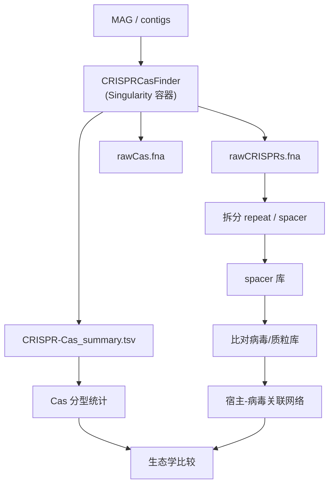

```{r include=FALSE}
Packages <- c("dplyr", "tidyr", "ggplot2", "stringr", "kableExtra")
pcutils::lib_ps(Packages)
knitr::opts_chunk$set(message = FALSE, warning = FALSE, eval = FALSE)
```

## 引言：为什么在宏基因组里研究 CRISPR

[CRISPR 相关学习](../p/crispr/) 这篇讲了 CRISPR 的基础生物学。但把它放进**宏基因组学**的语境里，问题就完全不同了——目前并没有成熟的"CRISPR 分析标准流程"，可做的方向很多，需要自己摸索。

从宏基因组研究 CRISPR 的价值主要在两方面：

1. **免疫记忆**：CRISPR array 里的 spacer 记录了宿主曾经遭遇过的移动遗传元件（噬菌体、质粒），因此 spacer 与病毒序列的匹配可以**推断宿主-病毒关系**；
2. **生态与进化**：不同环境中 CRISPR-Cas 系统的类型分布、丰度、多样性，反映了微生物与病毒之间的"军备竞赛"强度。

以下是我最初梳理的、一般性的研究步骤：

1. **数据获取**：从环境样品获得宏基因组测序数据；
2. **数据预处理**：质控与过滤，去除低质量序列和污染；
3. **CRISPR 序列识别**：用专门工具搜索重复序列（repeat）和间隔序列（spacer）的特征，并分类注释；
4. **CRISPR 序列分析**：分析 repeat/spacer 的一致性与多样性，推断系统类型与亚型，比较在不同样本中的分布；
5. **关联元件注释**：注释 CRISPR 相关蛋白（Cas 蛋白）与 crRNA；
6. **功能分析与预测**：通过与数据库比对预测 spacer 的来源（外源 DNA 来源、宿主-病原关系）；
7. **可视化与解释**：用图表、网络图、热图展示结构、分类与分布，讨论生态学与进化意义。

需要注意的挑战也不少：**序列组装的困难**（CRISPR array 常位于重复区域，组装易断裂）、大规模数据分析的复杂性、以及 CRISPR 序列的功能解释。

## 工具选型


CRISPR 序列识别的常用工具：

| 工具 | 特点 |
|------|------|
| **CRISPRCasFinder** | 识别 CRISPR 阵列 + 预测 Cas 蛋白，可给出 CRISPR-Cas 分型；功能最全 |
| CRT | CRISPR Recognition Tool，基于重复序列特征，较老 |
| PILER-CR | 识别并分类 CRISPR，速度快 |
| CRISPRDetect | 自动化发现与注释，输出较规范 |
| MinCED | 适合大规模基因组数据，轻量快速 |
| **CRISPRCasTyper** | 专门用于 CRISPR-Cas 基因的注释与分型（本站另有 [专文](../p/crisprcastyper)） |

**我的选择是 CRISPRCasFinder**——因为它同时完成"阵列识别"与"Cas 分型"，一步到位。仓库地址：<https://github.com/dcouvin/CRISPRCasFinder>，使用文档见 <https://github.com/dcouvin/CRISPRCasFinder/blob/master/CRISPRCasFinder_Viewer_manual.pdf>。

## 安装：为什么最后用了容器

按官方指引的 conda 安装方式：

```bash
conda env create -f ccf.environment.yml -n crisprcasfinder
conda activate crisprcasfinder
mamba init
mamba activate
mamba install -c bioconda macsyfinder=2.0
macsydata install -u CASFinder==3.1.0
```

我在集群上试的结果是 **conda 和 mamba 都报错，安装失败**。原因是 CRISPRCasFinder 依赖 MacSyFinder 的特定版本，与 conda 的依赖求解经常冲突。

由于集群已经装了 **Singularity**，改用容器是最省事的方案：

```bash
# 下载官方镜像
wget -c "https://crisprcas.i2bc.paris-saclay.fr/Home/DownloadFile?filename=CrisprCasFinder.simg"
```

> 容器化的好处在这里体现得很明显：**环境依赖被封装好了，不需要自己解依赖冲突**。这也是生物信息学软件分发的主流趋势。

## 运行 CRISPRCasFinder

### 基本命令

```bash
sample=$(head -n "$N" MAGlist | tail -n 1)
echo $sample

indir=dereplicated_genomes/
outdir=res

singularity exec -B $PWD CrisprCasFinder.simg \
    perl /usr/local/CRISPRCasFinder/CRISPRCasFinder.pl \
    -so /usr/local/CRISPRCasFinder/sel392v2.so \
    -cf /usr/local/CRISPRCasFinder/CasFinder-2.0.3 \
    -drpt /usr/local/CRISPRCasFinder/supplementary_files/repeatDirection.tsv \
    -rpts /usr/local/CRISPRCasFinder/supplementary_files/Repeat_List.csv \
    -cas -def G -rcfowce -gscf -cpuM 2 \
    -out $outdir/${sample} -in $indir/${sample}.fa
```

逐个参数解释：

| 参数 | 含义 |
|------|------|
| `singularity exec -B $PWD` | 在容器中执行，`-B $PWD` 把当前目录挂载进容器 |
| `perl .../CRISPRCasFinder.pl` | 主脚本 |
| `-so` | sel392v2.so 检测规则文件路径 |
| `-cf` | CasFinder 软件路径 |
| `-drpt` | 重复序列方向信息文件 |
| `-rpts` | 重复序列列表文件 |
| `-cas` | 执行 Cas 蛋白注释 |
| `-def G` | 默认重复序列方向设为 G |
| `-rcfowce` | 启用预测时的过滤器 |
| `-gscf` | 对 CRISPR 分类并汇总 |
| `-cpuM 2` | MacSyFinder 使用的 CPU 数 |
| `-out` / `-in` | 输出目录 / 输入 fasta |

> ⚠️ **最容易踩的坑**：容器只能访问**挂载目录（`$PWD`）内部**的文件。所以 input 和 output 的路径**必须**在挂载点之内，否则容器内看不到文件，会报"文件不存在"。

### 完整参数参考

```text
perl CRISPRCasFinder.pl [options] -in <filename.fasta>
    -in：输入序列（fasta 格式，后缀可为 .fasta/.fna/.mfa/.fa/.txt）
    -out：输出结果路径
    -keep：保留过程文件（Prodigal/Prokka、CasFinder、rawFASTA、Properties）
    -html：输出 HTML 网页格式结果
    -so：sel392v2.so 文件路径
    -mSS：CRISPR-Cas 系统的序列最短长度
    # 检测 CRISPR 阵列：
    -md：重复序列之间允许的错配比例，默认 20
    -t：截短的重复序列允许的错配比例，默认 33.3
    -mr：重复序列的最短长度，默认 23
    -xr：重复序列的最长长度，默认 55
    -ms：spacer 的最短长度，默认 25
    -xs：spacer 的最长长度，默认 60
    -n：不允许重复序列的错配
    -pm：spacer 与重复序列长度比的最小值，默认 0.6
    -px：spacer 与重复序列长度比的最大值，默认 2.5
    -s：spacer 之间相似度的最大值，默认 60
    -cpuP：程序运行使用的 CPU 数，默认 1
    -meta：分析宏基因组序列
    -gcode：密码子表，默认 11
    -gscf：汇总 Cas-finder 文件并复制到 TSV 结果
    -cas：用 Prokka 搜寻 cas 酶基因
    -ccvr：输出 CRISPR-Cas 临近报告（必须设置 -cs）
    -cpuM：MacSyFinder 使用的 CPU 数，默认 1
    -ccc：允许对 CRISPR 与 Cas 进行分类
    -def：严格程度，默认 SubTyping
```

在**宏基因组**场景下，记得加 `-meta`。

## 输出文件解读

典型输出（`rawCas.fna` 可能缺失，表示未检测到 Cas）：

```bash
$ ll
total 192K
drwxr-xr-x 2 pengchen jianglab  40K Apr 15 13:43 GFF
-rw-r--r-- 1 pengchen jianglab 116K Apr 15 13:43 result.json
drwxr-xr-x 2 pengchen jianglab 4.0K Apr 15 13:43 TSV
-rw-r--r-- 1 pengchen jianglab 4.3K Apr 15 13:43 rawCRISPRs.fna
-rw-r--r-- 1 pengchen jianglab  22K Apr 15 13:43 rawCas.fna
```

| 文件 | 内容 |
|------|------|
| `result.json` | 检测到的 CRISPR 阵列与 Cas 基因的主信息（JSON 格式） |
| `rawCRISPRs.fna` | 所有检测到的 CRISPR 阵列序列（FASTA） |
| `rawCas.fna` | 所有检测到的 Cas 基因序列（FASTA） |
| `GFF/` | CRISPR 与 Cas 的位置信息（GFF 格式），带 `annotation` 前缀的是含 CRISPR array 的 contig |
| `TSV/` | 见下表 |

`TSV/` 目录下的三张表最常用：

| 文件 | 内容 |
|------|------|
| `Cas_REPORT.tsv` | 检测到的 Cas 系统与基因信息（也有 Excel 格式） |
| `CRISPR-Cas_summary.tsv` | CRISPR 与 Cas 的摘要信息 |
| `Crisprs_REPORT.tsv` | 检测到的 CRISPR 阵列信息 |

其中 **`CRISPR-Cas_summary.tsv`** 是做分型统计时的主表，包含每个 CRISPR-Cas 系统的类型（如 I-E、II-A）与证据等级。

## 整理 spacer：从阵列到 spacer 列表

拿到 `rawCRISPRs.fna` 后，下一步是把每个 CRISPR array 拆成**repeat 与 spacer 交替**的序列单元。这是后续做宿主预测的前提。

拆分逻辑很直接：给定 repeat 序列（来自 `CRISPR-Cas_summary.tsv` 的 consensus repeat）与两侧的 flanking 序列，按 repeat 出现的位置切分即可。

下面用 R 演示这个解析过程（用一段模拟的 array 序列）：

```{r}
library(stringr)

# 模拟一个 CRISPR array：repeat(R) 与 spacer(S) 交替
repeat_seq <- "GTTTTAGAGCTATGCTGTTTTG"
array_seq  <- paste(
  rep(c(repeat_seq, "ACGTACGTACGTACGTACGTACGTACGTAC"), 3),
  collapse = ""
)

# 按 repeat 出现的位置切分，取中间的片段即为 spacer
# 用 lookahead 保留分隔符，再过滤掉 repeat 本身
parts <- strsplit(array_seq, paste0("(?=", repeat_seq, ")"), perl = TRUE)[[1]]
spacers <- parts[!str_detect(parts, paste0("^", repeat_seq))]

cat("识别到 spacer 数:", length(spacers), "\n")
print(spacers)
```

在真实数据里，这个过程需要处理**部分 repeat、错配、以及阵列边界**等情况，因此建议用专门的解析函数，而不是简单正则。可参考的工具有 `crisprTools`、`CRISPRviz`，或自己写解析器（把整个流程封装成 R 包是好主意）。

## spacer 比对：推断宿主-病毒关系

整理出 spacer 之后，核心分析是**把 spacer 比对到病毒/质粒序列库**：

1. 准备序列库：病毒序列（如 IMG/VR、GVD）、质粒库；
2. 用 `blastn` / `mmseqs` 做短序列比对（注意：spacer 只有 30–40 bp，需要调低 `word_size`、放宽 `evalue`）；
3. 命中即表示该宿主曾经（或正在）抵抗该序列来源的元件；
4. 统计命中网络的**节点度分布**，可以估计病毒的宿主范围（广宿主 vs 专性）。

一个常见的做法是把"（MAG 来源）→ spacer → 病毒 contig"构造成三类节点网络，再用网络分析工具（如 [MetaNet](../p/metanet-1)）分析模块结构。

## 分析流程总览



## 注意事项

1. **array 在重复区，组装易断**。CRISPR 阵列本身是高度重复的序列，组装时容易塌缩或断裂，得到的可能是不完整阵列。用高质量 MAG（而非碎片化 contig）能显著改善；
2. **repeat 序列的多样性**。不同 CRISPR 类型的 repeat 长度与序列差异很大，跨类型用统一的解析脚本容易漏检；
3. **Cas 分型需要完整系统**。仅检测到 `cas` 基因片段不足以确定类型，要看 `CRISPR-Cas_summary.tsv` 给出的证据等级；
4. **spacer 比对是间接证据**。命中病毒序列只能说明"曾经接触过"，不能证明当前正在发生互作；
5. **容器挂载路径**：再强调一次，input/output 必须在 `$PWD` 内。

## 小结

在宏基因组中分析 CRISPR 的完整路径是：**CRISPRCasFinder（推荐用 Singularity 容器部署，回避依赖冲突）识别阵列与 Cas → 从 `CRISPR-Cas_summary.tsv` 做分型统计 → 从 `rawCRISPRs.fna` 拆分 spacer → 比对病毒/质粒库 → 构建宿主-病毒关联网络**。整个流程目前没有现成的"一键 pipeline"，这也正是它的机会所在——把解析、比对、统计封装成可复用的工具，是值得做的事。

## 参考文献与延伸

1. Couvin, D., et al. (2018). CRISPRCasFinder, an update of CRISRFinder, includes a portable version, enhanced performance and integrates search for Cas proteins. *Nucleic Acids Research*, 46(W1), W246–W251.
2. Shmakov, S., et al. (2020). Systematic prediction of functionally linked genes in bacterial and archaeal genomes. *Nature Protocols*, 15, 3411–3432.
3. CRISPRCasFinder 仓库：<https://github.com/dcouvin/CRISPRCasFinder>
4. 本站相关：[CRISPR 相关内容学习](../p/crispr)、[使用CRISPRCasTyper注释和分类CRISPR-Cas基因](../p/crisprcastyper)、[Anti-CRISPR 相关内容学习](../p/anti-crispr)
