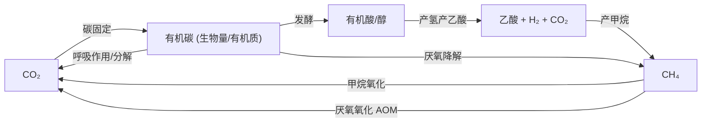
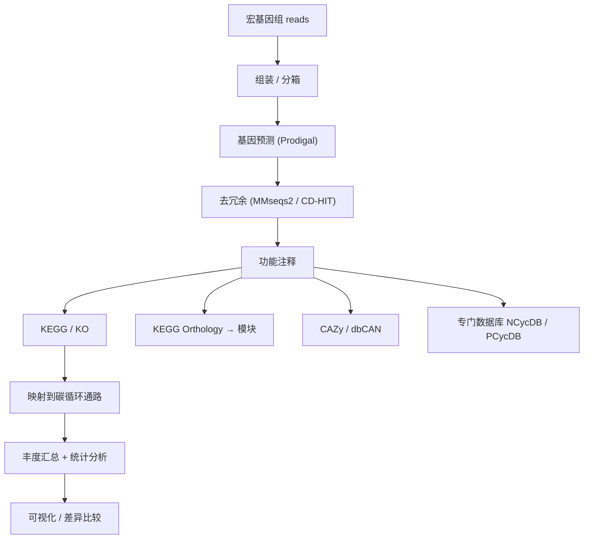

```{r include=FALSE}
Packages <- c("dplyr", "tidyr", "ggplot2", "kableExtra")
pcutils::lib_ps(Packages)
knitr::opts_chunk$set(
  message = FALSE, warning = FALSE,
  cache = TRUE, collapse = TRUE, fig.width = 7, fig.height = 4.5
)
showtext::showtext_auto()
```

## 引言：为什么关注碳循环的功能基因

生态系统中的营养物质是循环利用的。所有化学元素都在生物与环境之间不断流动，这个过程称为**生物地球化学循环（biogeochemical cycles）**。

微生物介导着各种氧化还原反应。围绕氮、碳、硫、铁等生源要素的代谢过程，研究者通过解析**特定代谢步骤中的功能酶及其编码基因**，逐步勾勒出环境中的元素循环网络。因此，**功能基因**成了连接"微生物群落组成"与"生态系统功能"之间的桥梁：

- 只做 16S / 物种组成分析，看到的是"谁在那里"；
- 加上功能基因分析，回答的才是"它们在做什么"。

碳循环是其中研究最透彻、也是与气候变化关联最紧密的一环。

## 碳循环的整体框架

碳在自然界主要以四种形态存在：**无机碳**（$\mathrm{CO_2}$、$\mathrm{CH_4}$、$\mathrm{HCO_3^-}$、碳酸盐）与**有机碳**（生物量、有机质）。微生物驱动的核心过程可以分成几条主线：



四条主线分别是：

1. **碳固定（Carbon fixation）**：把 $\mathrm{CO_2}$ 转为有机碳；
2. **有机碳降解（Organic matter degradation）**：把大分子有机物分解为小分子；
3. **甲烷代谢（Methanogenesis / Methanotrophy）**：产甲烷与甲烷氧化；
4. **一氧化碳与其它 C1 代谢**：如 CO 氧化。

```{r fig.width=10,fig.height=7}
library(pctax)
pctax::plot_element_cycle("Carbon cycle")
```

## 关键过程与标志基因

碳固定的六条已知途径，以及各自的标志基因，是功能注释时的核心参照：

| 途径 | 标志基因 | 说明 |
|------|----------|------|
| Calvin 循环 | `cbbL` / `cbbM`（RuBisCO）、`prk` | 植物、蓝细菌、部分变形菌 |
| 还原性 TCA 循环 | `aclB`、`porA` | 绿硫菌等厌氧菌 |
| Wood–Ljungdahl 途径 | `acsB`、`cooS`（CODH） | 产乙酸菌、产甲烷菌 |
| 3-羟基丙酸循环 | `accA`、`pccB` | 部分需氧菌 |
| 3-羟基丙酸/4-羟基丁酸循环 | `mct` | 泉古菌 |
| 二羧酸/4-羟基丁酸循环 | `mch` | 部分厌氧菌 |

有机碳降解涉及大量**碳水化合物活性酶（CAZymes）**，例如：

- 纤维素降解：内切葡聚糖酶 `cel`、外切葡聚糖酶 `cbh`、β-葡萄糖苷酶 `bgl`
- 半纤维素降解：`xyn`（木聚糖酶）、`man`（甘露聚糖酶）
- 木质素降解：过氧化物酶（`lignin peroxidase`、`Mn peroxidase`）、漆酶 `lac`

**甲烷代谢**是碳循环里最关键也最容易测定的环节之一：

| 过程 | 标志基因 |
|------|----------|
| 产甲烷（Methanogenesis） | `mcrA`（甲基辅酶 M 还原酶，最经典） |
| 甲烷氧化（Methanotrophy） | `pmoA` / `mmoX`（甲烷单加氧酶） |
| 厌氧甲烷氧化（AOM） | `mcrA`（反向）+ ANME 类群 |

其中 **`mcrA`** 之于产甲烷，就像 **`nifH`** 之于固氮、**`amoA`** 之于氨氧化——都是被广泛用作"过程存在与否"的分子标记。

## 分析流程：从宏基因组到碳循环潜力

一条典型的功能基因分析路径是：



几个关键点：

1. **注释数据库的选择决定上限**。通用库（KEGG、eggNOG）覆盖面广，但对特定过程的基因不如专用库敏感；
2. **KEGG 的 KO → Module → Pathway 三级映射**，是把基因丰度"翻译"成过程潜力的常用手段；
3. **丰度归一化**要注意：功能基因的丰度通常要按测序深度或单拷贝标记基因（如 `recA`、`rpoB`）归一化，才能做跨样本比较。

## 实操：汇总碳循环功能基因丰度

下面用一个合成的小例子，演示如何把"基因 → 过程"映射后做汇总和可视化。

```{r}
set.seed(4719)

# 模拟 6 个样本、若干碳循环标志基因的丰度（RPKM 量化后的相对值）
genes <- c("cbbL", "cbbM", "prk", "aclB", "acsB", "cooS",
           "mcrA", "pmoA", "mmoX", "cel", "cbh", "bgl", "xyn", "lac")
samples <- paste0("S", 1:6)

expr <- matrix(
  rgamma(length(genes) * length(samples), shape = 3, scale = 1),
  nrow = length(genes),
  dimnames = list(genes, samples)
)

# 让 "碳固定" 组在 S1-S3 更高，"甲烷代谢" 组在 S4-S6 更高，制造可观察的差异
fixation <- c("cbbL", "cbbM", "prk", "aclB", "acsB", "cooS")
methane  <- c("mcrA", "pmoA", "mmoX")
expr[fixation, 1:3] <- expr[fixation, 1:3] * 3
expr[methane,  4:6] <- expr[methane,  4:6] * 3
round(expr, 2)
```

### 基因 → 过程的映射

```{r}
# 定义标志基因到碳循环过程的映射表
pathway_map <- data.frame(
  gene = c("cbbL", "cbbM", "prk", "aclB", "acsB", "cooS",
           "mcrA", "pmoA", "mmoX", "cel", "cbh", "bgl", "xyn", "lac"),
  process = c("碳固定", "碳固定", "碳固定", "碳固定", "碳固定", "碳固定",
              "甲烷代谢", "甲烷代谢", "甲烷代谢",
              "有机碳降解", "有机碳降解", "有机碳降解", "有机碳降解", "有机碳降解")
)

# 按过程汇总（求和）
process_abund <- expr |>
  as.data.frame() |>
  tibble::rownames_to_column("gene") |>
  left_join(pathway_map, by = "gene") |>
  pivot_longer(-c(gene, process), names_to = "sample", values_to = "abundance") |>
  group_by(process, sample) |>
  summarise(abundance = sum(abundance), .groups = "drop")

process_abund
```

### 可视化

```{r, fig.height = 4}
ggplot(process_abund, aes(sample, abundance, fill = process)) +
  geom_col(position = "dodge", width = 0.7) +
  labs(x = NULL, y = "相对丰度", fill = "碳循环过程") +
  theme_bw() +
  theme(legend.position = "top")
```

从这张图里可以直接读出两类信号：`碳固定` 组在 S1–S3 占优势，`甲烷代谢` 组在 S4–S6 占优势——这正是我们人为设置的差异。真实数据里，这种"过程层级的丰度分布"就是解释样本间功能差异的起点。

如果需要看基因层面的细节，可以画热图：

```{r, fig.height = 5}
expr_log <- log10(expr + 1e-6)

heat <- expr_log |>
  as.data.frame() |>
  tibble::rownames_to_column("gene") |>
  pivot_longer(-gene, names_to = "sample", values_to = "log10_abund") |>
  left_join(pathway_map, by = "gene")

ggplot(heat, aes(sample, gene, fill = log10_abund)) +
  geom_tile(color = "white", linewidth = 0.3) +
  facet_grid(process ~ ., scales = "free_y", space = "free_y", switch = "y") +
  scale_fill_viridis_c(name = expression(log[10]("丰度"))) +
  labs(x = NULL, y = NULL) +
  theme_bw() +
  theme(strip.text.y.left = element_text(angle = 0), axis.text.y = element_text(size = 7))
```

## 结果解读与注意事项

拿到功能基因结果后，有几处常见的解读陷阱：

1. **"存在"不等于"表达/活跃"**。DNA 层面的功能基因只能说明**遗传潜力（potential）**。要回答"是否正在进行"，需要用宏转录组、宏蛋白组或稳定同位素探针（SIP）来验证。
2. **基因拷贝数不等价于功能强度**。同一基因在不同类群中的拷贝数、酶动力学、表达调控都不同，直接比丰度是粗略近似。
3. **注意注释假阳性**。短序列比对到远缘同源基因会带来假阳性，尤其对 `mcrA`、`pmoA` 这类存在旁系同源家族的基因，建议比对时提高 identity 阈值并人工核对。
4. **务必归一化**。跨样本比较前要统一测序深度或单拷贝基因丰度，否则丰度差异可能只反映测序量差异。
5. **区分"群落组成差异"与"功能差异"**。有时功能基因谱稳定而物种组成变化，这种**功能冗余**本身就是重要发现。

## 优缺点

### 功能基因分析的优点

1. **直接对应功能**：比纯物种组成更接近生态系统过程；
2. **可跨类群比较**：不受分类注释完整性的限制；
3. **数据库日渐完善**：KEGG、NCycDB、PCycDB 等持续更新；
4. **可与宏转录组/代谢组互证**：形成"潜力 → 表达 → 代谢产物"的证据链。

### 局限

1. **只反映潜力**：DNA 层面无法判断实际活性；
2. **依赖注释质量**：数据库覆盖度决定可靠性，新基因容易漏检；
3. **丰度≠速率**：基因丰度与反应速率之间并非线性关系；
4. **通路拼接困难**：宏基因组数据难以确认同一通路的所有基因来自同一基因组。

## 小结

碳循环由几条主线构成——碳固定、有机碳降解、甲烷代谢与 C1 代谢，每条线都有对应的标志基因（如 `cbbL`、`mcrA`、`pmoA`）。分析上，典型路径是"组装 → 基因预测 → 去冗余 → 功能注释 → 映射到通路 → 丰度汇总"。最关键的两条原则是：**选择合适的功能数据库**，以及牢记 **DNA 层面的功能基因只代表潜力而非活性**。

## 参考文献与延伸

1. Hug, L. A., et al. (2016). A new view of the tree of life. *Nature Microbiology*, 1, 16048.
2. Kanehisa, M., & Goto, S. (2000). KEGG: Kyoto Encyclopedia of Genes and Genomes. *Nucleic Acids Research*, 28(1), 27–30.
3. Berg, I. A., et al. (2010). Autotrophic carbon fixation in archaea. *Nature Reviews Microbiology*, 8, 447–460.
4. NCycDB / PCycDB 等元素循环专用数据库：<https://github.com/qichao1984/NCyc>
