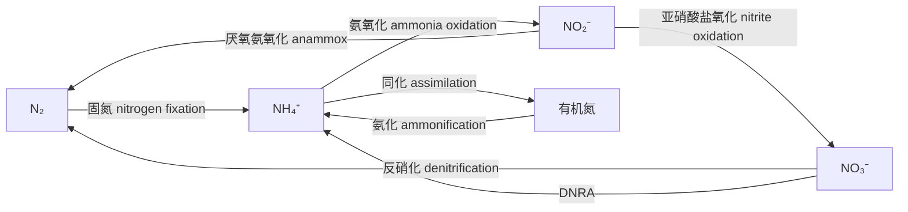
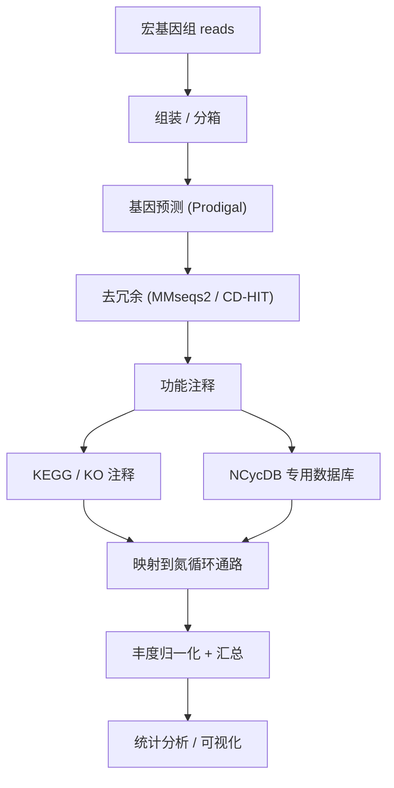

```{r include=FALSE}
Packages <- c("dplyr", "tidyr", "ggplot2", "kableExtra")
pcutils::lib_ps(Packages)
knitr::opts_chunk$set(
  message = FALSE, warning = FALSE,
  cache = TRUE, collapse = TRUE, fig.width = 7, fig.height = 4.5
)
showtext::showtext_auto()
```

## 引言：为什么关注氮循环的功能基因

上一节讲了[碳元素循环（C-cycling）](../p/c-cycling)，它与氮循环在微生物代谢上高度耦合。氮是所有生命体合成蛋白质与核酸的必需元素，而自然界中的氮以多种**价态**存在，从 $\mathrm{NH_4^+}$（-3）到 $\mathrm{NO_3^-}$（+5），每一次价态变化都由特定的微生物酶系催化。

这些转化步骤中，**功能基因**是判断"某过程是否存在、由谁执行、强度如何"的核心依据。相比 16S 的物种组成分析，功能基因分析能直接回答生态学上真正关心的问题：**这个生态系统在固氮还是在脱氮？硝化潜力有多大？**

## 氮循环的整体框架

自然界氮的转化可以概括为以下几大过程：



七条主线：

1. **固氮（Nitrogen fixation）**：$\mathrm{N_2} \rightarrow \mathrm{NH_4^+}$，把惰性氮气转为可利用氮；
2. **氨化（Ammonification）**：有机氮矿化为 $\mathrm{NH_4^+}$，把有机氮释放回无机池；
3. **氨氧化（Ammonia oxidation）**：$\mathrm{NH_4^+} \rightarrow \mathrm{NO_2^-}$，硝化的第一步；
4. **亚硝酸盐氧化（Nitrite oxidation）**：$\mathrm{NO_2^-} \rightarrow \mathrm{NO_3^-}$，硝化的第二步；
5. **反硝化（Denitrification）**：$\mathrm{NO_3^-} \rightarrow \mathrm{N_2}$，逐步还原回氮气；
6. **厌氧氨氧化（Anammox）**：$\mathrm{NH_4^+} + \mathrm{NO_2^-} \rightarrow \mathrm{N_2}$，直接生成氮气；
7. **硝酸盐异化还原为铵（DNRA）**：$\mathrm{NO_3^-} \rightarrow \mathrm{NH_4^+}$，把氮留在生态系统中。

其中，**固氮**是唯一的"输入"过程，**反硝化与厌氧氨氧化**是主要的"输出"过程，二者的平衡决定生态系统的氮收支。

```{r fig.width=14,fig.height=10}
library(pctax)
pctax::plot_element_cycle()
```


## 关键过程与标志基因

| 过程 | 标志基因 | 编码的酶 |
|------|----------|----------|
| 固氮 | `nifH`（`nifD`、`nifK`） | 固氮酶 |
| 氨化 | `ureC`、`gdh` | 脲酶、谷氨酸脱氢酶 |
| 氨氧化 | `amoA`（`amoB`、`amoC`） | 氨单加氧酶 |
| 亚硝酸盐氧化 | `nxrA` / `nxrB` | 亚硝酸盐氧化还原酶 |
| 反硝化 | `nirS` / `nirK`、`norB`、`nosZ` | 亚硝酸盐/一氧化氮/氧化亚氮还原酶 |
| 厌氧氨氧化 | `hzsA` / `hzsB`、`hdh` | 联氨合成酶、联氨脱氢酶 |
| DNRA | `nrfA` | 亚硝酸盐还原酶（异化型） |

几个要点：

- **`nifH`** 是固氮的经典分子标记，与 `mcrA` 一样被广泛用于定量；
- **`amoA`** 分 AOA（氨氧化古菌）与 AOB（氨氧化细菌）两支，引物设计时需注意区分；
- **反硝化是一串连续步骤**，只看单个基因会低估能力，`nirS`/`nirK` + `norB` + `nosZ` 的组合才能判断是否走完全程；
- **`nosZ`**（$N_2O \rightarrow N_2$）特别重要，因为 $N_2O$ 是强温室气体，缺 `nosZ` 会使其成为排放源；
- **厌氧氨氧化**用 `hzsA` / `hzsB` 标记，它是海洋氮损失的重要贡献者。

## 分析流程

与碳循环类似，氮循环的功能基因分析也遵循同一条路径：



两条注释路线的差别值得说明：

- **KEGG 通用路线**：覆盖面广，能同时看到所有代谢过程，但某些氮循环基因（尤其是新发现的）可能缺少对应 KO；
- **NCycDB 专用路线**：专门为氮循环构建的序列数据库，对 `nifH`、`amoA`、`nosZ` 等标记基因的灵敏度更高。做专项研究时推荐两者互补。

## 实操：氮循环功能潜力评估

下面用合成数据演示"基因 → 过程 → 归一化 → 比较"的完整链路。

```{r}
set.seed(2028)

genes <- c("nifH", "ureC", "gdh", "amoA", "nxrA", "nxrB",
           "nirS", "nirK", "norB", "nosZ", "hzsA", "hdh", "nrfA")
samples <- paste0("S", 1:6)

# 模拟基因丰度（原始 count，负二项分布）
counts <- matrix(
  MASS::rnegbin(length(genes) * length(samples), mu = 200, theta = 5),
  nrow = length(genes),
  dimnames = list(genes, samples)
)

# 模拟"农田"样本（S1-S3）固氮/硝化强，"湿地"样本（S4-S6）反硝化强
nitrify <- c("nifH", "amoA", "nxrA", "nxrB")
denitri <- c("nirS", "nirK", "norB", "nosZ", "hzsA", "hdh")
counts[nitrify, 1:3] <- counts[nitrify, 1:3] * 4
counts[denitri, 4:6] <- counts[denitri, 4:6] * 4

# 按文库大小归一化（RPKM 思路：除以样本总 counts）
rel <- sweep(counts, 2, colSums(counts), "/") * 1e6
round(rel, 1)
```

### 过程映射与汇总

```{r}
ncyc_map <- data.frame(
  gene    = c("nifH", "ureC", "gdh", "amoA", "nxrA", "nxrB",
              "nirS", "nirK", "norB", "nosZ", "hzsA", "hdh", "nrfA"),
  process = c("固氮", "氨化", "氨化", "氨氧化", "亚硝酸盐氧化", "亚硝酸盐氧化",
              "反硝化", "反硝化", "反硝化", "反硝化", "厌氧氨氧化", "厌氧氨氧化", "DNRA")
)

process_rel <- rel |>
  as.data.frame() |>
  tibble::rownames_to_column("gene") |>
  left_join(ncyc_map, by = "gene") |>
  pivot_longer(-c(gene, process), names_to = "sample", values_to = "rel_abund") |>
  group_by(process, sample) |>
  summarise(rel_abund = sum(rel_abund), .groups = "drop")

process_rel
```

### 可视化：过程层级的热图

```{r, fig.height = 4.5}
# 每个过程占总氮循环基因的比例，便于跨样本比较
process_frac <- process_rel |>
  group_by(sample) |>
  mutate(frac = rel_abund / sum(rel_abund)) |>
  ungroup()

ggplot(process_frac, aes(sample, process, fill = frac)) +
  geom_tile(color = "white", linewidth = 0.4) +
  scale_fill_viridis_c(labels = function(x) paste0(round(x * 100), "%")) +
  labs(x = NULL, y = NULL, fill = "占比") +
  theme_bw()
```

从图中可以看出：S1–S3（农田）的固氮与硝化相关过程占比更高，S4–S6（湿地）的反硝化与厌氧氨氧化占比更高——这与我们设置的分组差异一致。

### 反硝化是否"走完全程"

$N_2O$ 排放的关键在于**反硝化是否完整**。可以单独比较 `nosZ`（末端步骤）与上游基因的相对比例：

```{r, fig.height = 3.5}
dn <- rel[c("nirS", "nirK", "norB", "nosZ"), ] |>
  as.data.frame() |>
  tibble::rownames_to_column("gene") |>
  pivot_longer(-gene, names_to = "sample", values_to = "rel_abund")

ggplot(dn, aes(sample, rel_abund, fill = gene)) +
  geom_col(position = "dodge", width = 0.75) +
  labs(x = NULL, y = "相对丰度", fill = "反硝化基因") +
  theme_bw() +
  theme(legend.position = "top")
```

若 `nosZ` 相对 `nirS`/`nirK` 明显偏低，提示该系统可能**不完整的反硝化**占主导，有 $N_2O$ 净排放风险。这是氮循环功能分析里最有实际意义的推断之一。

## 结果解读与注意事项

1. **"潜力"不等于"速率"**。与碳循环一样，DNA 层面的功能基因只说明遗传潜力。要评估真实速率，需要 $^{15}N$ 同位素示踪、宏转录组或直接速率测定。
2. **注意过程的"串联"性质**。反硝化是四步连续反应，`nir`、`nor`、`nos` 分别对应不同步骤，只看一个基因会得到误导性结论。
3. **区分同源基因家族**。`nirS` 与 `nirK` 是功能等价但不同源的酶，`amoA` 有 AOA / AOB 两套，注释时必须细分。
4. **归一化方式影响结论**。用总 reads、单拷贝标记基因（如 `recA`）还是 16S 归一化，会得到不同的相对关系，需在研究内保持一致。
5. **关注新的通路**。完整氨氧化（comammox，`Nitrospira`）等新发现会改变对传统"两步硝化"的理解，数据库更新要及时跟进。

## 优缺点

### 优点

1. **直接对应生态功能**：能区分固氮、硝化、反硝化等不同氮转化方向；
2. **标记基因成熟**：`nifH`、`amoA`、`nosZ` 等有大量文献与引物支持；
3. **可定量比较**：归一化后可在样本间、生境间比较功能潜力；
4. **与温室气体关联**：`nosZ` 等基因直接关联 $N_2O$ 排放，应用价值明确。

### 局限

1. **潜力≠活性**：不能替代速率测定；
2. **注释依赖数据库**：通用库可能漏掉特化基因；
3. **通路完整性难判定**：宏基因组无法保证同一通路基因来自同一基因组；
4. **定量精度受限**：短读长注释的假阳性、拷贝数差异都会带来偏差。

## 小结

氮循环由固氮、氨化、硝化、反硝化、厌氧氨氧化与 DNRA 等过程构成，每一步都有对应的标志基因（`nifH`、`amoA`、`nirS`/`nirK`、`nosZ`、`hzsA`、`nrfA` 等）。分析路径与碳循环一致：**组装 → 基因预测 → 去冗余 → 功能注释（KEGG + NCycDB）→ 丰度归一化 → 过程汇总与比较**。最有价值的判断之一，是看**反硝化是否完整**（`nosZ` 是否缺失），这直接关系到 $N_2O$ 的净排放。

## 参考文献与延伸

1. Kuypers, M. M. M., Marchant, H. K., & Kartal, B. (2018). The microbial nitrogen-cycling network. *Nature Reviews Microbiology*, 16, 263–276.
2. Tu, Q., et al. (2019). NCycDB: a curated integrative database for fast and accurate metagenomic profiling of nitrogen cycling genes. *Bioinformatics*, 35(6), 1040–1048.
3. Daims, H., et al. (2015). Complete nitrification by Nitrospira bacteria. *Nature*, 528, 504–509.
4. NCycDB：<https://github.com/qichao1984/NCyc>
5. 相关教程：[碳元素循环（C-cycling）](../p/c-cycling)
