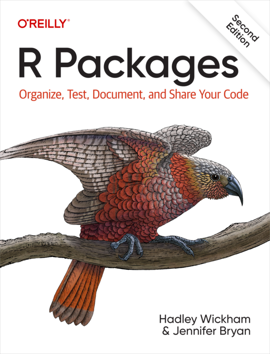
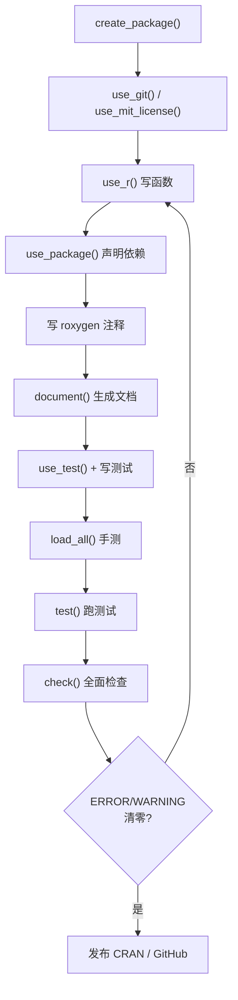

```{r include=FALSE}
Packages <- c("usethis", "devtools", "roxygen2", "testthat")
knitr::opts_chunk$set(message = FALSE, warning = FALSE, eval = FALSE)
```

## 为什么要有规范



以前写包是"东学一点西学一点拼凑起来"，用 RStudio 的 New Package 模板和直接用 `devtools` 搭出来的结构还有点不一样。要把这件事一次解决，最好是系统地走一遍 [R Packages](https://r-pkgs.org/)（Hadley Wickham & Jennifer Bryan）的思路。

核心结论先放在前面：**规范的意义在于让包"可被验证"**。`R CMD check` 会沿着这套约定检查你的包，而 NAMESPACE、DESCRIPTION、文档这些文件不是形式主义——它们是把"一堆函数文件"变成"可安装、可依赖、可测试的软件"的必要条件。

## 一、一次性的初始化

`usethis` 把"创建包"拆成一系列**通常只调用一次**的函数：

| 函数 | 作用 |
|------|------|
| `create_package()` | 创建包骨架（生成 `DESCRIPTION`、`NAMESPACE`、`R/`） |
| `use_git()` | 初始化 git 仓库 |
| `use_mit_license()` | 添加许可证 |
| `use_testthat()` | 配置单元测试框架 |
| `use_github()` | 关联远程仓库 |
| `use_readme_rmd()` | 生成 `README.Rmd` |

```r
usethis::create_package("~/Documents/R/mypkg")
```

执行后会得到一个最小可用的包骨架。

## 二、日常开发：加函数与加依赖

包建好之后，开发过程中**会反复调用**的是这一组：

```r
usethis::use_r("my_fun")     # 在 R/ 下新建 my_fun.R
usethis::use_test("my_fun")  # 在 tests/testthat/ 下新建对应测试
usethis::use_package("dplyr") # 声明依赖
```

`create_package()` 之后，`R/` 目录下的每个 `.R` 文件都是一份源码。**一个文件放多个相关函数**是可接受的，通常按主题组织（如 `plot.R`、`io.R`）。

## 三、高频循环：加载 → 文档 → 测试 → 检查

这三四个命令会**每天甚至每小时**用到：

```r
devtools::load_all()   # 模拟安装，把当前代码加载进会话
devtools::document()   # 用 roxygen2 注释生成 man/ 与 NAMESPACE
devtools::test()       # 跑单元测试
devtools::check()      # 完整 R CMD check
```

它们的分工是：

- **`load_all()`**：不同于 `source()`，它会按照包的加载机制工作（处理命名空间、S3 方法注册等），是开发期探索代码的**正确方式**；
- **`document()`**：把写在函数上方的 `#'` 注释转成 `.Rd` 帮助文档，并生成 `NAMESPACE`；
- **`test()` / `check()`**：前者快、聚焦测试；后者慢、覆盖全部检查项。

> 经验：改完代码先 `load_all()` 手测，再 `document()` 更新文档，最后 `check()` 收尾。`check()` 会给出 NOTE / WARNING / ERROR 三级提示，**目标是把 ERROR 和 WARNING 清零**，NOTE 尽量解释清楚。

## 四、两条最容易犯的错

这是我在实践中最需要注意、也最容易被忽略的两条。

### 1. 包内永远不要用 `library()` 或 `require()`

```r
# ✗ 错误示范（写在 R/ 下的函数里）
my_fun <- function() {
  library(dplyr)      # 不要这样
  ...
}
```

原因：`library()` 会**修改搜索路径（search path）**，影响全局环境中其他代码可用的函数，产生难以追踪的副作用。

正确做法是在 `DESCRIPTION` 中声明依赖：

```r
usethis::use_package("dplyr")            # 默认 Imports
usethis::use_package("ggplot2", "Suggests")
```

然后在代码里用 `::` 显式调用：

```r
my_fun <- function(df) {
  dplyr::filter(df, x > 0)   # ✓ 显式命名空间
}
```

`Imports` 与 `Suggests` 的区别很重要：

- **Imports**：函数运行**必需**的包，安装时会一并安装；
- **Suggests**：仅用于示例、测试或可选功能的包，可以不装。

### 2. 永远不要用 `source()`

`source()` 会在**当前环境**里直接执行代码，把结果插入进来，完全绕过包的加载机制：

```r
# ✗ 在 R/ 下的代码里不要这样
source("R/helpers.R")
```

开发期想看某个文件的改动是不是生效，用 `load_all()`；想在包里附带数据，用 `usethis::use_data()` 把数据存进 `data/`。

## 五、命名与可用性检查

包名这件事值得先花五分钟。`available` 包提供了 `available()`，从多个角度评估：

```r
library(available)
available("doofus")
```

它会检查：是否已被 CRAN / Bioconductor 占用、是否与已有包名过于相似、是否与 GitHub 仓库重名、是否含有不当含义等。**包名一旦发布就很难改**（改名的代价是所有用户都要改代码），所以宁可在这一步多花时间。

## 六、文档：roxygen2 注释

包里的函数文档写在函数上方，以 `#'` 开头：

```r
#' 计算向量的平方和
#'
#' @param x 数值型向量
#' @return 数值，平方和
#' @export
#' @examples
#' sum_squares(c(1, 2, 3))
sum_squares <- function(x) {
  sum(x^2)
}
```

`devtools::document()` 会据此生成 `man/sum_squares.Rd`，并更新 `NAMESPACE`：

- 有 `@export` → 函数被导出，用户可以直接调用；
- 没有 `@export` → 内部函数，外部不可见。

常用标签：

| 标签 | 作用 |
|------|------|
| `@param` | 参数说明 |
| `@return` | 返回值说明 |
| `@export` | 导出该函数/方法 |
| `@examples` | 示例代码（`check()` 会运行） |
| `@inheritParams` | 从其它函数继承参数文档 |
| `@importFrom` | 声明导入的具体函数 |

## 七、测试：testthat

`use_testthat()` 配置好之后，测试文件与源码文件一一对应：

```r
# tests/testthat/test-sum_squares.R
test_that("sum_squares 计算正确", {
  expect_equal(sum_squares(c(1, 2, 3)), 14)
  expect_error(sum_squares("a"))     # 非数值输入应报错
})
```

测试的价值在**重构时**体现得最明显：改完实现跑一遍 `test()`，能立刻知道有没有破坏原有行为。

## 八、README 与数据

```r
usethis::use_readme_rmd()    # README.Rmd，可嵌入代码生成示例
usethis::use_data(mydata)    # 把对象存到 data/，随包分发
usethis::use_vignette("intro") # 长文教程（vignette）
```

`README.Rmd` 是包的"门面"：安装方式、最小示例、状态徽章。它在 GitHub 上被渲染，是别人决定要不要用你的包时的第一印象。

## 完整流程回顾



## 常见问题

- **`check()` 报 "no visible binding for global variable"**：多半是在 `dplyr` 这类 NSE 场景里用了列名，可用 `utils::globalVariables()` 声明，或改用 `.data$col`；
- **`Imports` 和 `Depends` 怎么选**：除非是"用户也需要直接使用"的包，否则一律用 `Imports`；`Depends` 会挂在用户的搜索路径上，慎用；
- **示例代码报错导致 `check()` 失败**：用 `\dontrun{}` 包住需要外部资源的例子；
- **文档中的中文**：确保 `.Rd` 文件用 UTF-8 编码，`DESCRIPTION` 里可加 `Encoding: UTF-8`。

## 小结

规范化的 R 包开发可以概括为一条流水线：**`create_package()` 开局 → `use_r()` / `use_package()` 日常开发 → `load_all()` / `document()` / `test()` / `check()` 循环 → 发布**。最需要改变习惯的两条是：**包内不用 `library()`**（改用 DESCRIPTION 声明 + `::` 调用）、**不用 `source()`**（改用 `load_all()`）。把这两条内化，`R CMD check` 就会从"找麻烦"变成"帮你把关"。

## 参考文献与延伸

1. Wickham, H., & Bryan, J. *R Packages* (2nd ed.)：<https://r-pkgs.org/>
2. `usethis` 文档：<https://usethis.r-lib.org/>
3. `devtools` 文档：<https://devtools.r-lib.org/>
4. `roxygen2` 文档：<https://roxygen2.r-lib.org/>
5. `available` 包：<https://github.com/r-lib/available>
6. 本站相关：[iPhylo 生成并绘制优美的分类树](../p/iphylo)、[R进阶使用技巧](../p/r-tips)
