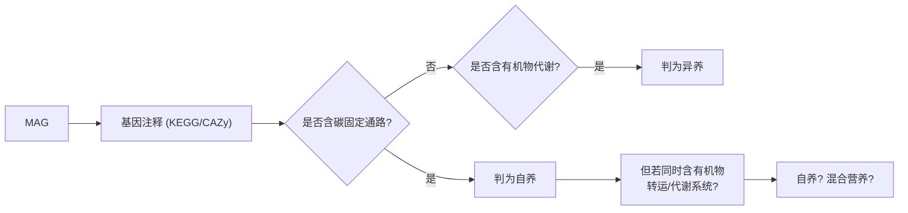

## 引言

自养、异养和混合营养是人类描述生物**能量来源与碳源获取方式**的基本分类。这套概念最早从植物与动物的对比中建立，但一旦进入微生物世界，它的边界就变得相当模糊。本文想讨论的正是这种模糊性：**当我们从宏基因组里看到一个基因组既编码光合系统、又编码有机物代谢通路时，到底该把它判成哪一类？**

## 教科书里的三类营养策略

先回顾常规定义：

1.  **自养（Autotrophic）**
    - 从**无机物**合成有机物（碳水化合物、脂类、蛋白质）；
    - 能量来自外部——光能（光合作用）或化学能（化学合成）；
    - 以$\mathrm{CO_2}$ 为碳源；
    - 代表：植物、藻类、蓝细菌、硝化细菌。
2.  **异养（Heterotrophic）**
    - 不能从无机物合成有机物，必须**摄取现成有机物**；
    - 通过分解吸收有机物获得能量与碳；
    - 代表：动物、真菌、大多数细菌。
3.  **混合营养（Mixotrophic）**
    - 同时具备自养与异养能力，**依据环境条件灵活切换**；
    - 在资源充足的条件下可能以异养为主，在无机环境中则依赖自养；
    - 代表：部分鞭毛藻、一些蓝细菌、许多兼性自养细菌。

在生态系统中，这三类分别对应**生产者、消费者/分解者、以及两者间的灵活过渡**。

## 问题：自养生物真的”完全不吸收有机物”吗

这里有一个值得推敲的地方。自养生物通过光合作用合成有机碳，但同时也要通过**呼吸作用消耗**这些有机碳来获得能量——也就是说，它自己合成的有机物同样要进入分解代谢途径。

那么问题来了：

> 如果给一个能进行光合作用的细胞提供**现成的外源有机物**，它用于有机物代谢的酶，能分辨出哪些碳是自己合成的、哪些是从外界吸收的吗？

从酶的角度看，显然**不能**——代谢通路只认分子，不认来源。那么：

$$
\text{自养} + \text{可利用外源有机物} \;\overset{?}{=}\; \text{混合营养}
$$

如果答案是肯定的，那么”严格的自养”就成了一个几乎不存在的概念（除非该生物**完全缺乏**摄取有机物的转运系统）。

这提示我们：营养类型的划分其实包含**两个彼此独立的维度**：

1.  **碳源维度**：碳从哪来？（$`\mathrm{CO_2}`$ vs 有机物）
2.  **能量维度**：能量从哪来？（光 vs 化学能 vs 有机物氧化）

教科书里的”自养/异养”把两者捆绑在一起讲，但在微生物里，这两个维度经常**解耦**。

## 更精确的划分框架

按”碳源 × 能量来源”两个维度，可以把营养策略展开成一张更清晰的表：

| 碳源  能量 | 光能 | 无机化学能 | 有机物 |
|----|----|----|----|
| **$`\mathrm{CO_2}`$（自养）** | 光自养（photoautotroph） | 化能自养（chemolithoautotroph） | 有机营养型（organotroph，兼性） |
| **有机物（异养）** | 光异养（photoheterotroph） | 化能异养（chemoorganoheterotroph） | 化能异养 |

由此衍生的几个关键概念：

- **光异养（Photoheterotrophy）**：用光产能量、但碳源是有机物。许多紫色非硫细菌属于这一类；
- **化能自养（Chemolithoautotrophy）**：氧化无机物（$`\mathrm{NH_4^+}`$、$`\mathrm{H_2S}`$、$`\mathrm{Fe^{2+}}`$）产能，以$\mathrm{CO_2}$ 为碳源。硝化细菌、硫氧化细菌是典型；
- **兼性自养（Facultative autotrophy）**：具备自养通路，但在有机物充足时优先异养。这实际上就是**混合营养在细菌中的常见形式**。

也就是说，**“混合营养”在微生物里往往是常态而非例外**——只要一个基因组同时携带碳固定通路与有机碳转运/代谢系统，它在表型上就有混合营养的潜力。

## 宏基因组中的实践困境

这正是我们在做宏基因组分析时遇到的真实问题。流程通常是：



困境在于：

1.  **通路的”存在”是二值的，但表达是可调的**。基因存在只说明**遗传潜力**，不代表在当前环境下真的在用；
2.  **转运系统常被忽略**。判断能否利用外源有机物，关键其实在于有没有相应的**转运蛋白（transporter）**，而很多注释流程只看代谢酶；
3.  **碳固定通路本身分布很广**。如还原性 TCA 循环、Wood–Ljungdahl 途径在多个类群中存在，仅凭一条通路就判”自养”过于草率；
4.  **基因组的完整性影响判断**。MAG 不完整时，缺失通路可能是**组装遗漏**而非真的没有。

## 一个更稳妥的判断思路

综合上述问题，实践中可以采取”**证据加权**”而非”单基因定论”的做法：

**第一层：碳固定能力**

检查是否携带完整（而非零散）的碳固定通路，六条已知途径的标志基因见[碳循环](../p/c-cycling)一文。

**第二层：有机碳摄取能力**

检查是否携带有机物转运系统（如 ABC transporter、MFS transporter）与下游分解酶（CAZymes、糖酵解等）。

**第三层：能量代谢**

检查是否有光系统（`pufLM` 等）、或无机物氧化酶（`amoA`、`sox` 等）。

**第四层：生态学证据**

结合环境条件（有无光照、氧浓度、有机物浓度）与转录组/同位素数据判断**实际**采用的策略。

最终判断可以用一个简化的决策逻辑：

- 有自养通路 + **无**有机碳摄取系统 → **专性自养**（少见）；
- 有自养通路 + **有**有机碳摄取系统 → **兼性自养 / 混合营养**（常见）；
- 无自养通路 + 有有机碳代谢 → **异养**。

需要强调的是第二行：**在微生物里，这往往才是”自养”基因组的真实状态**。

## 实操：营养类型注释的汇总

下面用一个合成例子，演示如何把注释结果整理成”营养策略”分型计数。

``` r
set.seed(3141)

n_mag <- 120
mags <- paste0("MAG", sprintf("%03d", seq_len(n_mag)))

# 每个 MAG 的注释结果（1 = 携带该通路）
anno <- data.frame(
  mag = mags,
  carbon_fix = rbinom(n_mag, 1, 0.35),      # 碳固定通路
  organo_uptake = rbinom(n_mag, 1, 0.75),   # 有机碳转运/代谢
  photo = rbinom(n_mag, 1, 0.12),           # 光系统
  litho = rbinom(n_mag, 1, 0.30)            # 无机物氧化
)

# 按规则给每个 MAG 判型
anno <- anno |>
  mutate(
    trophic = case_when(
      carbon_fix == 1 & organo_uptake == 0 ~ "专性自养",
      carbon_fix == 1 & organo_uptake == 1 ~ "兼性自养/混合营养",
      carbon_fix == 0 & organo_uptake == 1 ~ "异养",
      TRUE ~ "未知/不完整"
    ),
    energy = case_when(
      photo == 1 ~ "光能",
      litho == 1 ~ "无机化学能",
      TRUE ~ "有机"
    )
  )

# 交叉统计：碳源策略 × 能量来源
tab <- anno |>
  count(trophic, energy) |>
  tidyr::complete(trophic, energy, fill = list(n = 0))

knitr::kable(tab, caption = "合成 MAG 数据集的营养策略分型（n = 120）")
```

| trophic           | energy     |   n |
|:------------------|:-----------|----:|
| 专性自养          | 光能       |   1 |
| 专性自养          | 无机化学能 |   4 |
| 专性自养          | 有机       |   4 |
| 兼性自养/混合营养 | 光能       |   4 |
| 兼性自养/混合营养 | 无机化学能 |   8 |
| 兼性自养/混合营养 | 有机       |  17 |
| 异养              | 光能       |   6 |
| 异养              | 无机化学能 |  22 |
| 异养              | 有机       |  33 |
| 未知/不完整       | 光能       |   1 |
| 未知/不完整       | 无机化学能 |   6 |
| 未知/不完整       | 有机       |  14 |

<span id="tab:mag"></span>Table 1: 合成 MAG 数据集的营养策略分型（n = 120）

### 可视化

``` r
ggplot(tab, aes(energy, trophic, fill = n)) +
  geom_tile(color = "white", linewidth = 0.5) +
  geom_text(aes(label = n), color = "white", size = 4) +
  scale_fill_viridis_c() +
  labs(x = "能量来源", y = "碳源策略", fill = "MAG 数") +
  theme_bw()
```

}}index.en_files/figure-html/unnamed-chunk-2-1.png" alt="" width="672" />

这张表能直接呈现一项常见现象：**“兼性自养/混合营养”格子里占了大头**。在真实数据里看到类似格局时，它提示的正是本文开头那个结论——营养类型的边界在微生物中并不锐利。

## 相关文献线索

这个问题在文献里已有不少讨论，几篇值得一读的起点：

- 关于混合营养在微生物中的普遍性综述：<https://www.frontiersin.org/articles/10.3389/fmicb.2021.761869/full>
- 关于自养与异养代谢耦合的理论分析：<https://www.sciencedirect.com/science/article/pii/S0022519309005165?via%3Dihub>
- 关于营养策略与生态位的讨论：<https://www.publish.csiro.au/fp/Fulltext/FP13061>

> 注：这里的文献以链接形式给出，具体引用信息可查阅原文。

## 小结

营养策略的分类（自养 / 异养 / 混合营养）在教科书里是清晰的三分，但在微生物世界，**碳源维度与能量维度经常解耦**，因此”自养基因组同时具备有机物摄取系统”是常态而非例外。对宏基因组分析而言，这意味着：

1.  不要用**单个标志基因**判定营养类型；
2.  要同时检查**碳固定通路**与**有机碳转运/代谢系统**；
3.  明确区分**遗传潜力**与**实际活性**；
4.  把”兼性自养/混合营养”作为默认假设，而不是例外。

## 参考文献与延伸

1.  本站相关：[碳元素循环（C-cycling）](../p/c-cycling)、[氮元素循环（N-cycling）](../p/n-cycling)
2.  混合营养综述：*Frontiers in Microbiology*, 2021, 12, 761869.
3.  自养-异养代谢耦合的理论分析：*Journal of Theoretical Biology*, 2009.
4.  营养策略与生态位：*Functional Plant Biology*, 2013, FP13061.
