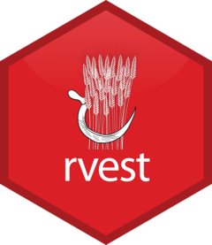
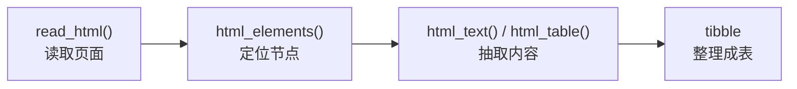

```{r include=FALSE}
Packages <- c("rvest", "dplyr", "stringr", "kableExtra")
pcutils::lib_ps(Packages)
knitr::opts_chunk$set(
  message = FALSE, warning = FALSE,
  cache = TRUE, collapse = TRUE, fig.width = 7, fig.height = 4.5
)
```

## 什么是网页抓取



**网页抓取（web scraping）** 指的是用程序自动从网页中提取结构化信息的过程。它解决的核心问题是：**数据只以"网页"的形式存在，没有现成的表格或 API**。

典型场景：

- 把一个页面上的表格（文献列表、物种名录、排行榜）转成 data.frame；
- 批量抓取列表中每条记录的详情页（标题、作者、日期、摘要）；
- 监控某个页面的内容变化。

### 为什么用 R 做

Python 的 `requests` + `BeautifulSoup` 更常被提到，但如果你已经在 R 里做数据分析，**`rvest` 的优势是数据不落地**——抓下来直接是 tibble，可以立刻接 `dplyr` 做清洗、接 `ggplot2` 出图，省掉了中间导出 CSV 的环节。

rvest 是 tidyverse 成员之一，由 Hadley Wickham 维护，设计风格与 tidyverse 一致（管道、tibble）。

### 抓取前必须知道的三件事

1. **先看有没有 API**。很多网站提供官方 API（如 Crossref、PubMed），优先用 API 而非爬网页，更稳定也更合规；
2. **看 robots.txt**。访问 `https://站点/robots.txt`，确认目标路径是否被允许抓取；
3. **控制频率**。加延时、限制并发，不要对服务器造成压力。爬虫的礼貌程度直接影响你的 IP 会不会被封。

## 安装

```r
install.packages("rvest")

library(rvest)
library(dplyr)
library(stringr)
```

## 核心概念

rvest 的工作流只有四步：



关键在于第二步：**如何"定位"想要的节点**。这就要用到 **CSS 选择器**。

## CSS 选择器速查

CSS 选择器是 rvest 定位节点的语言。掌握下面这张表就能应付绝大多数场景：

| 选择器 | 含义 | 示例 |
|--------|------|------|
| `tag` | 标签名 | `table`、`li`、`h2` |
| `.class` | class 属性 | `.title`、`.author` |
| `#id` | id 属性 | `#main`、`#results` |
| `tag.class` | 同时匹配 | `div.content` |
| `a[href]` | 含某属性 | `a[href]` |
| `tag > tag` | 直接子元素 | `ul > li` |
| `tag tag` | 后代元素 | `div p` |
| `:nth-child(n)` | 第 n 个 | `li:nth-child(2)` |

例如：

- `"#t"`：id 为 `t` 的元素；
- `"ul.tags li"`：class 为 `tags` 的 ul 里的所有 li；
- `"table.data tr"`：class 为 data 的表格里的所有行。

## 实操一：从字符串解析 HTML

为了可复现（不依赖网络、不受页面改版影响），先用一段**内联的 HTML 字符串**演示全部 API：

```{r}
library(rvest)

html <- '
<html><body>
  <h1 id="title">文献列表</h1>
  <table id="papers">
    <tr><th>gene</th><th>logFC</th><th>padj</th></tr>
    <tr><td>geneA</td><td>2.10</td><td>0.001</td></tr>
    <tr><td>geneB</td><td>-1.40</td><td>0.021</td></tr>
    <tr><td>geneC</td><td>0.85</td><td>0.340</td></tr>
  </table>
  <ul class="tags">
    <li>CRISPR</li><li>virus</li><li>metagenome</li>
  </ul>
</body></html>'

page <- read_html(html)
page
```

### 抽取标题

```{r}
page |>
  html_element("#title") |>
  html_text()
```

`html_element()` 返回**第一个**匹配的节点，`html_elements()` 返回**所有**匹配的节点——这是最容易混淆的一对函数。

### 抽取表格

`html_table()` 会直接把 `<table>` 解析成 data.frame，这是 rvest 最实用的功能之一：

```{r}
tb <- page |>
  html_element("#papers") |>
  html_table()

tb
```

注意列名来自表头 `<th>`，如果页面没有表头，需要用 `html_table(header = FALSE)` 并手动命名。

### 抽取列表

```{r}
page |>
  html_elements(".tags li") |>
  html_text()
```

### 抽取属性（如链接）

文本用 `html_text()`，**属性用 `html_attr()`**：

```{r}
html_links <- '<a href="/p/mofa/">MOFA</a><a href="/p/julia/">Julia</a>'
read_html(html_links) |>
  html_elements("a") |>
  html_attr("href")
```

### 组合成表

抓取列表页时最常见的任务是"对每个元素抽取多个字段，拼成表"。用 `map()` 或 `sapply()` 遍历：

```{r}
html_cards <- '
<div class="card"><h2 class="t">第一篇</h2><span class="a">张三</span></div>
<div class="card"><h2 class="t">第二篇</h2><span class="a">李四</span></div>
<div class="card"><h2 class="t">第三篇</h2><span class="a">王五</span></div>'

cards <- read_html(html_cards) |> html_elements(".card")

tibble(
  title  = cards |> html_element(".t") |> html_text(),
  author = cards |> html_element(".a") |> html_text()
)
```

> **要点**：`html_element()` 作用在节点集合上时，会**逐个**取每个节点的第一个匹配子元素。这是拼表的关键——不需要写循环。

## 实操二：真实网页抓取

真实的抓取流程与上面完全一致，只是把 `read_html(字符串)` 换成 `read_html(url)`：

```{r eval=FALSE}
library(rvest)
library(dplyr)

url <- "https://example.com/papers"

page <- read_html(url)

papers <- page |>
  html_elements("table.paper-list tr") |>
  # 跳过表头行
  tail(-1) |>
  (\(rows) tibble(
    title = rows |> html_element("td:nth-child(1)") |> html_text(trim = TRUE),
    journal = rows |> html_element("td:nth-child(2)") |> html_text(trim = TRUE),
    year = rows |> html_element("td:nth-child(3)") |> html_text(trim = TRUE)
  ))()

papers
```

对于"列表页 + 详情页"的两级结构，标准做法是：

```{r eval=FALSE}
# 1. 先抓列表页，拿到所有详情页链接
detail_urls <- page |>
  html_elements("a.paper-link") |>
  html_attr("href") |>
  # 补全相对路径
  url_absolute(url)

# 2. 逐个抓详情页，中间加延时
details <- lapply(detail_urls, function(u) {
  Sys.sleep(1)                    # 礼貌延时，别去掉
  p <- read_html(u)
  tibble(
    url = u,
    abstract = p |> html_element(".abstract") |> html_text(trim = TRUE),
    keywords = p |> html_elements(".keywords li") |> html_text(trim = TRUE) |> paste(collapse = "; ")
  )
}) |> bind_rows()
```

### 查看页面结构

抓真实网页时的第一件事，是**在浏览器里找到选择器**：

1. 打开目标页面，右键 → 检查（Inspect）；
2. 在 Elements 面板里定位到目标元素；
3. 右键该元素 → Copy → Copy selector；
4. 把得到的选择器粘到 `html_elements()` 里，先在 R 里验证 `html_text()` 的输出对不对。

也可以用 **`xml2::xml_structure()`** 直接看节点树（`rvest` 底层基于 `xml2`，两者可以混用）：

```{r}
read_html(html) |> html_element("#papers") |> xml2::xml_structure()
```

## 常见问题与排错

| 现象 | 原因 | 解决 |
|------|------|------|
| `html_elements()` 返回空 | 选择器写错，或内容由 JS 动态渲染 | 先 `html_structure()` 看结构；动态内容见下 |
| 表格解析成 1 列 | 表格有合并单元格 | 用 `html_table(fill = TRUE)` |
| 中文乱码 | 页面编码非 UTF-8 | `read_html(url, encoding = "GBK")` |
| 抓到的是登录页 | 需要 Cookie / 认证 | 用 `httr2` 会话维持登录态 |
| 拿不到数据 | 内容由 JavaScript 生成 | `read_html()` 只解析返回的 HTML，不执行 JS |

**关于 JavaScript 渲染的页面**：`rvest` 不执行 JS，所以对 SPA（单页应用）往往抓不到内容。可选方案：

- 找到页面背后的 **API**（在浏览器 Network 面板里看 XHR 请求），直接用 `httr2` 调接口——**这是最推荐的做法**；
- 用 `chromote` / `seleniumPipes` 驱动真实浏览器渲染后再解析。

## 礼貌抓取准则

这一节是硬性要求，不是建议：

1. **先读 robots.txt**：

   ```r
   read_html("https://example.com/robots.txt") |> html_text()
   ```

2. **加延时**：循环里 `Sys.sleep(1)` 是最低要求，站点较大时酌情增加；
3. **带上 User-Agent**，如实说明身份：

   ```r
   read_html(url, httr::user_agent("MyResearchBot/1.0 (contact@example.com)"))
   ```

4. **控制并发**：不要开几十个并行请求打同一台服务器；
5. **能缓存就缓存**：抓下来的原始 HTML 存本地，重跑时读缓存，避免重复请求；
6. **遵守服务条款**：部分站点明确禁止抓取，需先确认。

## 优缺点

### 优点

1. **零落地**：抓取结果直接是 tibble，无缝接入 tidyverse 流程；
2. **API 简洁**：`read_html()` → `html_elements()` → `html_text()` 三步走；
3. **表格解析省事**：`html_table()` 一行把 HTML 表格变 data.frame；
4. **与 tidyverse 一致**：管道风格统一，学习成本低。

### 局限

1. **不执行 JavaScript**：动态渲染页面抓不到，需要找 API 或上浏览器；
2. **依赖页面结构**：页面改版会导致选择器失效，需要定期维护；
3. **正则/选择器调试麻烦**：选择器写错时往往返回空而非报错；
4. **不适合大规模爬取**：并发能力弱，抓取量大时不如 Python 生态的工具。

## 小结

rvest 的用法可以浓缩成四步：**`read_html()` 读页面 → `html_elements()` 用 CSS 选择器定位 → `html_text()` / `html_attr()` / `html_table()` 抽内容 → 拼成 tibble**。真正需要练习的是 CSS 选择器，其余都是它的自然延伸。最后记住三件事：**优先用官方 API、先看 robots.txt、控制抓取频率**——技术之外，这三点决定了你的抓取是否可持续。

## 参考文献与延伸

1. rvest 官方文档：<https://rvest.tidyverse.org/>
2. rvest 用例教程：<https://rvest.tidyverse.org/articles/rvest.html>
3. W3C CSS 选择器规范：<https://www.w3.org/TR/selectors-4/>
4. 礼貌抓取与 robots.txt：<https://www.robotstxt.org/robotstxt.html>
5. 本站相关：[R整理和分析文献信息](../p/r-paper-list)、[批量下载NCBI genome相关数据](../p/ncbi-genome)
