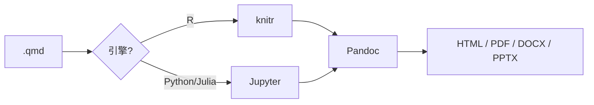

## Quarto 是什么


[Quarto](https://quarto.org/) 是一个**开源的科学与技术出版系统**，基于 Markdown，可以用来创建报告、文档、幻灯片、网站与书籍。它由 Posit（原 RStudio 公司）主导开发，可以看作是 **R Markdown 的跨语言继任者**。

它的核心定位可以用一句话概括：**一次编写，多种输出，且不限于 R**。

- **多种输出**：同一份 `.qmd` 可以渲染成 HTML、PDF、Word、PPT、网站、书籍；
- **多语言**：原生支持 **R、Python、Julia、Observable JS**，甚至可以在同一文档里混用（通过 Jupyter 内核）；
- **可复现**：代码与叙述混排，结果由图、表、代码块自动生成。

它与 R Markdown 的关系，可以理解为"同一套思想的下一代实现"：R Markdown 由 R 社区驱动、以 R 为中心；Quarto 则把引擎抽象出来，让语言与文档格式解耦。

## 安装

Quarto 有两个部分：**命令行工具**（负责渲染）和 **编辑器支持**（可选）。

### 1. 安装 Quarto CLI

从官网下载对应平台的安装包：<https://quarto.org/docs/get-started/>

或使用包管理器（macOS）：

```bash
brew install --cask quarto
```

验证：

```bash
quarto --version
```

### 2. 在 RStudio / Positron 中使用

新版 RStudio 与 Positron 已内置 Quarto 支持，安装 CLI 后即可。检查：

```r
# 需要 quarto R 包作为接口
install.packages("quarto")
quarto::quarto_version()
```

## 从 R Markdown 到 Quarto

如果你已经熟悉 R Markdown，迁移成本其实很低。主要差异有四处：

| 项目 | R Markdown | Quarto |
|------|-----------|--------|
| 文件扩展名 | `.Rmd` | `.qmd` |
| 代码块引擎 | ```` ```{r} ```` | ```` ```{r} ````（R 兼容），Python 用 ```` ```{python} ```` |
| 文档级配置 | YAML header | YAML header（格式更丰富） |
| 渲染引擎 | `knitr` + `rmarkdown` | `knitr`（R）/ `jupyter`（Python 等）+ `quarto` |

一个最小的 Quarto 文档长这样：

```markdown
---
title: "我的分析报告"
author: "Peng Chen"
format: html
---

## 引言

这是一段正文。下面是 R 代码：


``` r
summary(cars)
```
```

注意 `---` 之间的 YAML 头里，**`format`** 取代了 R Markdown 的 `output`：

```yaml
format:
  html:
    toc: true
    code-fold: true
  pdf:
    documentclass: article
```

## 输出格式

Quarto 的输出格式是它最吸引人的地方：

| 目标 | `format` 值 | 说明 |
|------|-------------|------|
| 网页 | `html` | 默认，支持交互 |
| PDF | `pdf` | 需 LaTeX 或 TinyTeX |
| Word | `docx` | 适合投稿与协作 |
| 幻灯片 | `revealjs` / `beamer` / `pptx` | 网页 / LaTeX / PPT 三种风格 |
| 网站 | `quarto create project website` | 博客、文档站 |
| 书籍 | `quarto create project book` | 长文写作 |

同一份文档可以**同时输出多种格式**，只需在 YAML 里并列写出：

```yaml
format:
  html: default
  docx: default
```

渲染时 Quarto 会分别生成对应文件。

## 代码块选项

代码块选项（chunk options）的写法从 R Markdown 的 `#|` 风格继承了下来的 `#|` 语法：


```` default
```{r}
#| label: fig-scatter
#| fig-cap: "车速与刹车距离的关系"
#| echo: false
#| warning: false

plot(cars)
```
````

与 R Markdown 的 `{r, echo=FALSE}` 相比，`#|` 风格的好处是**语法统一**——不管后面接的是 R、Python 还是 Julia，选项写法都一样。

常用的选项：

| 选项 | 作用 |
|------|------|
| `echo` | 是否显示代码 |
| `eval` | 是否执行代码 |
| `output` | 是否显示输出 |
| `warning` / `message` | 是否显示警告/消息 |
| `fig-cap` | 图片标题 |
| `tbl-cap` | 表格标题 |
| `label` | 交叉引用用的标签 |

## 交叉引用

Quarto 的**交叉引用**系统比 R Markdown 更完整：给图、表、公式、章节打上标签，就能在正文里引用。


```` default
```{r}
#| label: fig-cars
#| fig-cap: "cars 数据集"
plot(cars)
```

参见 @fig-cars。
````

对于公式：


``` default
$$
E = mc^2
$$ {#eq-einstein}

由 @eq-einstein 可知……
```

注意：**显示公式的 `$$` 必须独占一行**（前后各一行），这是 Quarto 与本站渲染一致的要求。

## 与 knitr 的关系

用 R 作为引擎时，Quarto 底层仍然是 **knitr**：



- **R 代码块** → 走 `knitr`，与你熟悉的 R Markdown 行为一致；
- **Python / Julia 代码块** → 走 Jupyter 内核；
- **最后统一交给 Pandoc** 转换成目标格式。

因此，R Markdown 里学到的 knitr 知识（`opts_chunk$set()`、缓存、图形设备等）在 Quarto 里**大部分仍然适用**，这也是迁移成本低的原因。

## 我的使用感受

第一次上手时，最直接的体会是：

1. **上手快**：写过 R Markdown 的人几乎可以立刻开始写 `.qmd`，主要记 `format` 和 `#|` 两处差异；
2. **格式自由**：一份源文件同时产出网页和 Word 稿，对需要"既发博客又投稿"的场景非常实用；
3. **跨语言**：把 Python 与 R 的代码块放在一起时不再别扭，这对混用两种语言的流程是实质性改善；
4. **注意点**：PDF 输出需要 LaTeX 环境（推荐安装轻量的 TinyTeX）；幻灯片输出需要额外学习 revealjs/beamer 的主题配置。

## 优缺点

### 优点

1. **跨语言**：R / Python / Julia 统一在同一个文档系统里；
2. **多格式输出**：HTML / PDF / Word / PPT / 网站 / 书籍，一处编写多处发布；
3. **兼容 R Markdown**：knitr 知识可复用，迁移平缓；
4. **活跃维护**：Posit 主导，与 RStudio / Positron 深度集成；
5. **交叉引用强大**：图、表、公式、定理的统一编号与引用。

### 局限

1. **生态仍在演进**：相比 R Markdown，第三方主题与扩展（如自定义 output format）还在积累；
2. **PDF 依赖 LaTeX**：首次配置 TinyTeX 需要下载若干宏包；
3. **纯 R 生态下的插件兼容**：少数 R Markdown 专用扩展（如某些 `htmlwidgets` 的定制）需要额外适配；
4. **缓存行为差异**：Quarto 的缓存（freeze）机制与 knitr 的 `cache=TRUE` 不同，混用时要注意。

## 小结

Quarto 的定位是"R Markdown 的下一代、同时也是跨语言的科学出版系统"。核心三件事：**用 `format` 指定输出、用 `#|` 指定代码块选项、用 `@label` 做交叉引用**。对于已经写 R Markdown 的人，迁移几乎零门槛；对于需要混用 R 与 Python、或需要同时产出网页与投稿稿的人，它的收益是实实在在的。

## 参考文献与延伸

1. Quarto 官方文档：<https://quarto.org/docs/>
2. Quarto 起步教程：<https://quarto.org/docs/get-started/>
3. Posit 关于 Quarto 与 R Markdown 的说明：<https://quarto.org/docs/faq/>
4. 本站相关：[Markdown Syntax Guide](../p/2023-03-10-markdown)、[Mermaid 入门](../p/mermaid)
