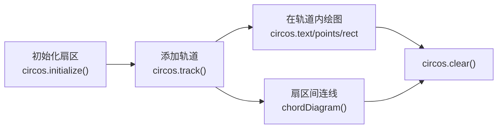

```{r include=FALSE}
Packages <- c("circlize", "dplyr", "ggplot2")
pcutils::lib_ps(Packages)
knitr::opts_chunk$set(
  message = FALSE, warning = FALSE,
  cache = TRUE, collapse = TRUE, fig.width = 7, fig.height = 7
)
```

## Circos 是什么

**Circos** 是一个用于绘制**环形图**的数据可视化工具，最初由 Martin Krzywinski 开发，用于展示基因组与染色体数据。它擅长表达**环形数据之间的关系**——染色体之间的关系、物种组成、多组学关联等。

Circos 的两个版本：

| 版本 | 语言 | 特点 |
|------|------|------|
| **Circos**（经典版） | Perl | 图表精美、高度可定制；配置繁琐，依赖 Perl 模块 |
| **circlize**（R 包） | R | 直接对接 R 的数据结构，无需学 Perl 配置语法 |

本文**先讲 Circos 经典版的安装与配置逻辑**（理解它的配置哲学有助于读懂官方示例），**再演示用 circlize 在 R 中实际作图**——后者是我日常更推荐的方式。

## Circos 经典版安装

Circos 用 Perl 编写，需要先有 Perl 环境与若干模块。

### 1. 安装 Perl

macOS / Linux 通常自带；Windows 建议装 **Strawberry Perl**。

### 2. 安装 Perl 模块

```bash
cpan install Config::General
cpan install List::MoreUtils
cpan install Font::TTF::Font
cpan install Math::Bezier
cpan install Math::VecStat
```

### 3. 下载 Circos 并检查

从官网下载：<http://circos.ca/software/download/>

解压后检查模块是否齐全：

```bash
circos -modules
```

如果报错：

```text
You are missing one or more Perl modules, require newer versions, or some modules failed to load.
```

就用 `circos -modules` 找出缺失的模块，交互式安装：

```bash
perl -MCPAN -e shell
# cpan[1]> install Math::Bezier
```

> **最大的坑是 GD 模块**。它与系统图形库绑定，不同 OS / Perl 版本的编译方式差异很大，需要针对自己的环境搜索教程。这也正是应该考虑改用 circlize 的原因之一。

检查完成：

```bash
circos -modules
circos -h
```

### 4. 常用命令行参数

```text
Usage:
      circos                    # 未设置 -conf 时自动搜索配置文件
      circos -conf circos.conf  # 指定配置文件
      circos -modules           # 诊断所需模块是否安装
      circos -debug_group GROUP1,[GROUP2,...]   # 组件详细 debug 信息
      circos -debug_group _all  # 全部 debug 信息
      circos ... [-silent]      # 不输出报告
      circos -cdump ideogram    # 查看配置块内容
      circos -param image/radius=2000p -param ideogram/show=no   # 覆盖配置
      circos -h                 # 帮助
      circos -v                 # 版本
```

## Circos 的配置结构

Circos 没有图形界面，典型工作流是：

1. **确定要展示的数据形式**（这一步最难，也最需要思考）；
2. 将数据解析成 Circos 要求的格式；
3. **构造配置文件**（可用官网模板，也可自己写）；
4. 运行 Circos，生成 PNG / SVG。

配置文件后缀为 `.conf`，是**类 HTML/XML 的标记文本**，每个标签对 `<TAG>...</TAG>` 代表一个配置块：

```perl
<plots>
    type = line          # 缩进不是必须的，只是便于阅读
    thickness = 2
    <plot>
        ...
    </plot>
</plots>
```

**作用域规则**是理解 Circos 配置的关键：外层（全局）变量对块内所有实例有效，内层定义优先级最高。例如：

```perl
<plots>
    fill_color = blue       # 对下面所有 <plot> 生效
    <plot>
        fill_color = red    # 对第一个 plot 覆盖为红色
    </plot>
    <plot>
        ...                 # 这个仍是 blue
    </plot>
</plots>
```

### 核心配置文件

基础配置文件位于 `$PATH/circos-0.69-4/etc/`：

| 文件 | 作用 |
|------|------|
| `Housekeeping.conf` | 基本框架配置，circos 必需，一般直接导入 |
| `fonts.conf` | 字体配置，标签与 `circos/fonts/` 下的 otf/ttf 一一对应 |
| `patterns.conf` | 模式配置，与 `circos/tiles/` 下的 png 对应 |
| `colors.conf` | 颜色配置，导入了 brewer / hsv / ucsc 三套色板 |

导入方式：

```perl
<<include etc/colors_fonts_patterns.conf>>
```

### 常用定制配置

| 文件 | 作用 |
|------|------|
| `ideogram.conf` | 染色体展示（bands、位置、间距、标签） |
| `ticks.conf` | 刻度标签 |
| `image.conf` | 图像大小、背景色、输出目录、圆周起始位置 |

### 主配置文件 circos.conf

```perl
karyotype = data/karyotype/karyotype.mouse.mm9.txt  # 核型文件
chromosomes_units = 1000000                         # 距离单位 (bp)
chromosomes_display_default = yes

<<include mydata/ideogram.conf>>
<<include mydata/ticks.conf>>

<image>
<<include etc/image.conf>>
</image>

<<include etc/colors_fonts_patterns.conf>>
<<include etc/housekeeping.conf>>
```

运行：

```bash
$PATH/bin/circos -conf circos.conf
```

## 更推荐的方式：R 的 circlize 包

Circos 经典版功能强大，但配置成本高。**`circlize` 包把同一套环形可视化能力搬进了 R**，可以直接用 data.frame 作图，无需学习 Perl 配置语法。

circlize 的核心思想是**"把直角坐标系里的绘图搬到极坐标"**：



### 基础示例：多扇区 + 弦图

下面用合成数据演示一个典型的"染色体 + 关系连线"图。

```{r}
library(circlize)

set.seed(71)

# 定义 5 个"染色体"扇区及其长度
sectors <- paste0("chr", 1:5)
sector_len <- c(120, 90, 150, 80, 110)
names(sector_len) <- sectors

# 设置扇区间隙，然后初始化
circos.par(gap.after = 3)
circos.initialize(factors = sectors, xlim = c(0, 1))

# 添加一条轨道，并在轨道里写扇区标签
circos.track(
  ylim = c(0, 1),
  panel.fun = function(x, y) {
    circos.text(
      x = 0.5, y = 0.5,
      labels = CELL_META$sector.index,
      facing = "bending.inside",
      niceFacing = TRUE,
      cex = 1
    )
  }
)

# 绘制弦图：扇区之间的关联
chord_data <- data.frame(
  from  = sample(sectors, 40, replace = TRUE),
  to    = sample(sectors, 40, replace = TRUE),
  value = runif(40, 1, 10)
)
chord_data <- chord_data[chord_data$from != chord_data$to, ]

chordDiagram(chord_data, transparency = 0.4, annotationTrack = "grid")

circos.clear()
```

### 典型应用一：基因组变异环形图

环形图最经典的用途是展示**基因组上的多组信息**。circlize 的做法是**多加几条轨道**：

```{r}
set.seed(2024)

chr_len <- c(chr1 = 200, chr2 = 150, chr3 = 180)
circos.par(start.degree = 90, gap.after = 5)
circos.initialize(names(chr_len), xlim = matrix(c(rep(0, 3), chr_len), ncol = 2))

# 轨道 1：染色体名称
circos.track(ylim = c(0, 1), bg.border = NA, track.height = 0.06,
             panel.fun = function(x, y) {
               circos.text(CELL_META$xcenter, 0.5, CELL_META$sector.index,
                           facing = "bending.inside", niceFacing = TRUE)
             })

# 轨道 2：GC 含量（折线）
for (chr in names(chr_len)) {
  n <- 40
  pos <- seq(1, chr_len[chr], length.out = n)
  gc <- 0.4 + 0.15 * sin(seq(0, 4 * pi, length.out = n)) + rnorm(n, 0, 0.03)
  circos.track(ylim = c(min(gc), max(gc)), track.height = 0.15, bg.border = "grey80")
  circos.lines(pos, gc, sector.index = chr, col = "steelblue")
}
```

### 典型应用二：微生物组组成环形堆叠图

把每个样本的菌门组成画成一层圆环，是微生物组的常见展示方式：

```{r}
# 合成 8 个样本、4 个门的相对丰度
set.seed(515)
samples <- paste0("S", 1:8)
phyla   <- c("Proteobacteria", "Firmicutes", "Actinobacteria", "Bacteroidetes")

comp <- as.data.frame(matrix(runif(length(samples) * length(phyla)), nrow = length(samples)))
comp <- comp / rowSums(comp)            # 归一化为相对丰度
rownames(comp) <- samples
colnames(comp) <- phyla

circos.par(start.degree = 90, gap.after = 2)
circos.initialize(factors = samples, xlim = c(0, 1))

# 每个样本一层轨道，用堆叠矩形表示各门占比
cols <- c("#4C72B0", "#DD8452", "#55A868", "#C44E52")
circos.track(
  ylim = c(0, 1), track.height = 0.08, bg.border = "grey70",
  panel.fun = function(x, y) {
    s <- CELL_META$sector.index
    vals <- as.numeric(comp[s, ])
    y0 <- 0
    for (k in seq_along(vals)) {
      circos.rect(0, y0, 1, y0 + vals[k], sector.index = s,
                  col = cols[k], border = "white")
      y0 <- y0 + vals[k]
    }
  }
)

legend("center", legend = phyla, fill = cols, bty = "n", cex = 0.8)
circos.clear()
```

> **注意**：`circos.clear()` 必须调用，否则后续绘图会叠加在当前布局上。这一点在循环出图时尤其重要——每次画完都要 `circos.clear()`，或者用 `circos.par()` 重新初始化。

## Circos 与 circlize 的选择

| 维度 | Circos (Perl) | circlize (R) |
|------|---------------|--------------|
| 学习成本 | 高（配置语法） | 低（R 语法） |
| 安装难度 | 高（Perl 模块、GD） | 低（`install.packages`） |
| 数据对接 | 需先导出为文本 | 直接吃 data.frame |
| 定制自由度 | 极高 | 高 |
| 与 R 流程整合 | 需外部调用 | 原生无缝 |
| 出图美观度 | 精雕细琢 | 开箱即用，可调 |

**结论**：如果你已经在用 R 做分析，**优先用 circlize**；只有当需要极端定制、或要复现别人的 `.conf` 时，才回到 Circos 经典版。

## 注意事项

1. **数据必须先归一化到扇区坐标**：`circos.initialize()` 的 `xlim` 决定每个扇区的坐标范围，之后所有 `circos.rect/points/lines` 都要用这套坐标；
2. **`circos.clear()` 别忘**：在多图循环里不加会出错；
3. **标签重叠**：扇区多、标签长时容易重叠，可用 `facing = "bending.inside"`、缩小 `cex`、或只标关键扇区；
4. **中文标签**：macOS 下若出现方框乱码，需要指定字体，例如 `circos.par(point.cell = 0.01)` 配合 `par(family = ...)`，或在 `circos.text()` 里用 `family` 参数；
5. **图例位置**：circlize 不自动放图例，通常用 `legend()` 手动放置，或用 `ComplexHeatmap::Legend()` 配合 `draw()`。

## 优缺点

### Circos 经典版的优点

1. **定制自由度最高**：几乎所有视觉元素都可配置；
2. **图表精美**：官网示例至今仍是环形图的标杆；
3. **输出格式丰富**：PNG / SVG / PDF。

### Circos 经典版的局限

1. **配置繁琐**：学习曲线陡峭；
2. **安装困难**：Perl 模块依赖是主要障碍；
3. **与 R 流程割裂**：数据需要导出再导入；
4. **调试困难**：配置写错时报错信息不够直观。

### circlize 的优点

1. **原生 R**：与 `dplyr`、`data.frame` 无缝衔接；
2. **API 清晰**：初始化 → 加轨道 → 绘图，三步走；
3. **易复现**：代码即配置，天然可版本控制；
4. **可组合**：可与 `ComplexHeatmap` 等包联动。

### circlize 的局限

1. **极端定制略受限**：某些 Circos 的精细效果需要绕路实现；
2. **调试仍需经验**：坐标系概念（扇区、轨道、CELL_META）需要理解；
3. **中文/字体问题**：跨平台字体配置需额外处理。

## 小结

Circos 是环形可视化的经典工具，它的配置哲学（标签块 + 作用域继承）值得了解，但**日常作图更推荐 R 的 circlize 包**——同样的效果，更低的成本，且与 R 分析流程无缝衔接。circlize 的核心是三步：**`circos.initialize()` 定义扇区 → `circos.track()` 添加轨道 → `circos.rect/points/lines/chordDiagram()` 绘图**，记得最后 `circos.clear()`。

## 参考文献与延伸

1. Krzywinski, M., et al. (2009). Circos: an information aesthetic for comparative genomics. *Genome Research*, 19(9), 1639–1645.
2. Gu, Z., et al. (2014). circlize implements and enhances circular visualization in R. *Bioinformatics*, 30(19), 2811–2812.
3. Circos 官网与文档：<http://circos.ca/documentation/>
4. circlize 官方书：<https://jokergoo.github.io/circlize_book/book/>
5. 本站相关：[R绘制优美的进化树（基础）](../p/r-tree)、[一些有趣的绘图R包](../p/r-vis-pkg)
