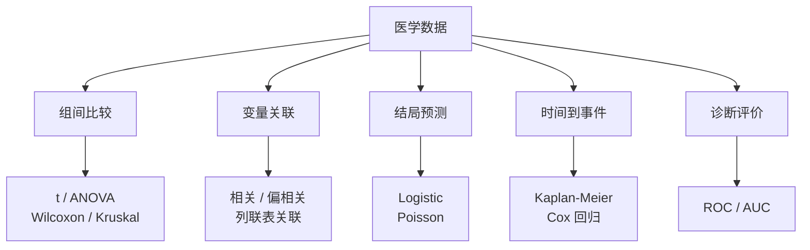

```{r include=FALSE}
Packages <- c("dplyr", "ggplot2", "survival", "survminer", "pROC", "vcd", "MASS", "kableExtra")
pcutils::lib_ps(Packages)
knitr::opts_chunk$set(
  message = FALSE, warning = FALSE,
  cache = TRUE, collapse = TRUE, fig.width = 7, fig.height = 4.5
)
library(showtext)
showtext_auto()
```

## 引言

这篇是学习《R语言医学数据分析实战》的笔记整理。医学数据分析的特点在于**研究设计复杂、结局变量类型多样、对统计假设敏感**——同一个"差异"问题，用错了检验方法就会得出错误结论。

本文按分析任务的类型组织，覆盖医学研究中最常见的几类问题：



## 一、组间比较

选检验方法的核心是回答两个问题：**几组？配对与否？数据是否满足正态/方差齐性？**

| 情形 | 参数方法 | 非参数替代 |
|------|----------|------------|
| 两组、独立 | `t.test()`（含 `var.equal`） | `wilcox.test()` |
| 两组、配对 | `t.test(paired = TRUE)` | `wilcox.test(paired = TRUE)` |
| 多组、独立 | `aov()` + `TukeyHSD()` | `kruskal.test()` |
| 多组、配对 | 重复测量 ANOVA | `friedman.test()` |
| 方差齐性检验 | `var.test()` | — |

```{r}
# 用 survival 包的 ovarian 数据演示
library(survival)
data(cancer, package = "survival")
ov <- ovarian
str(ov)
```

### 两组比较：t 检验与 Wilcoxon

```{r}
# 先检查方差齐性
var.test(age ~ rx, data = ov)
```

```{r}
# 参数方法
t.test(age ~ rx, data = ov)
```

```{r}
# 非参数方法（不假设正态）
wilcox.test(age ~ rx, data = ov)
```

> **实践建议**：医学数据常为小样本、偏态分布（如住院天数、费用），这种情况下直接上非参数检验更稳妥。报告时要写清用了哪种检验及理由。

### 多组比较：ANOVA 与 Kruskal-Wallis

```{r}
ov$agegr <- cut(ov$age, c(0, 50, 65, 100), labels = c("<50", "50-65", ">65"))

# 参数方法：单因素方差分析
fit_aov <- aov(futime ~ agegr, data = ov)
summary(fit_aov)
```

```{r}
# 非参数方法
kruskal.test(futime ~ agegr, data = ov)
```

ANOVA 显著后需要**事后两两比较**：

```{r}
TukeyHSD(fit_aov)
```

## 二、变量关联

### 连续变量：相关与偏相关

用一份模拟的临床指标数据演示（年龄、血压、某生物标志物）：

```{r}
set.seed(4096)
n <- 80

# 让"年龄"同时影响血压与生物标志物，制造混杂
age   <- rnorm(n, 55, 10)
bp    <- 90 + 0.8 * age + rnorm(n, 0, 8)          # 血压：受年龄影响
biomk <- 20 + 0.5 * age + rnorm(n, 0, 5)          # 标志物：受年龄影响

clin <- data.frame(age = age, bp = bp, biomarker = biomk)

# 简单相关
cor(clin$bp, clin$biomarker)
cor.test(clin$bp, clin$biomarker)
```

**偏相关**用于控制第三个变量的影响——这是医学研究里很常见的需求（例如"控制了年龄后，指标 A 与 B 是否仍相关"）。原理是把两个变量各自对控制变量做回归，再求残差的相关：

```{r}
#' 偏相关：控制 z 后 x 与 y 的相关
pcor_manual <- function(x, y, z) {
  rx <- resid(lm(x ~ z))
  ry <- resid(lm(y ~ z))
  cor(rx, ry)
}

# 控制年龄后，血压与标志物的相关
pcor_manual(clin$bp, clin$biomarker, clin$age)
```

> 若安装了 `ggm`，也可用 `ggm::pcor(c("bp", "biomarker", "age"), var(clin))`，结果一致。这里手写实现是为了说明偏相关的本质。

可以看到：**控制年龄之后，相关系数明显下降**。这正是"相关不等于因果"在数据分析层面的体现——原始相关有一部分是由共同的驱动变量（年龄）带来的。

### 分类变量：列联表关联

```{r}
library(vcd)
data("Arthritis")

tab <- xtabs(~ Improved + Treatment, data = Arthritis)
summary(assocstats(tab))
```

`assocstats()` 会给出多个关联系数（Phi、Cramer's V、Contingency Coefficient），选择哪个取决于表格维度：

- **2×2 表**：用 Phi 系数；
- **大于 2×2**：用 Cramer's V。

### 一致性分析：Kappa

评估两名评估者（或两种方法）的一致性时，用 **Kappa 系数**：

```{r}
# 模拟两名阅片者的 4 分类评分
class  <- c("Normal", "Benign", "Suspect", "Cancer")
raterA <- gl(4, 4, label = class)
raterB <- gl(4, 1, 16, label = class)
freq   <- c(50, 2, 0, 1, 2, 30, 4, 3, 0, 0, 20, 1, 1, 3, 4, 25)

table1 <- xtabs(freq ~ raterA + raterB)
knitr::kable(addmargins(table1), caption = "两名评估者的评分交叉表")
```

```{r}
vcd::Kappa(table1)
```

Kappa 的解读惯例：

| Kappa | 一致性 |
|-------|--------|
| < 0 | 差于随机 |
| 0–0.20 | 轻微 |
| 0.21–0.40 | 一般 |
| 0.41–0.60 | 中等 |
| 0.61–0.80 | 高度 |
| 0.81–1.00 | 几乎完全一致 |

> **注意**：Kappa 会受**患病率（prevalence）**影响。当某类别极度不平衡时，即使观察一致率很高，Kappa 也可能偏低（即 Kappa 悖论）。这时应同时报告 PABAK 或观察一致率。

## 三、Logistic 回归

当结局是**二分类**（患病/未患病、死亡/存活）时，用 Logistic 回归。

### 二分类结局

```{r}
library(MASS)
data("birthwt")

# low：出生体重 < 2.5kg
glm1 <- glm(low ~ age + lwt + race + smoke + ptl,
            data = birthwt, family = binomial)
summary(glm1)
```

**如何解读系数**：Logistic 回归的系数是**对数优势比（log odds ratio）**，要转成 OR 才直观：

```{r}
or_tab <- data.frame(
  term = names(coef(glm1)),
  beta = coef(glm1),
  OR   = exp(coef(glm1)),
  CI_low  = exp(confint.default(glm1))[, 1],
  CI_high = exp(confint.default(glm1))[, 2]
)
knitr::kable(or_tab, digits = 3, caption = "Logistic 回归结果（OR 及其 95% CI）")
```

**似然比检验**用于比较嵌套模型（例如检验 `race` 这个多分类变量整体是否显著）：

```{r}
# 完整模型 vs 去掉 race 的简约模型
glm_null <- glm(low ~ age + lwt + smoke + ptl, data = birthwt, family = binomial)

# 偏差之差服从卡方分布，自由度为参数个数之差
pchisq(deviance(glm_null) - deviance(glm1),
       df = df.residual(glm_null) - df.residual(glm1),
       lower.tail = FALSE)
```

### 多分类与有序结局

**无序多分类**用 `nnet::multinom()`：

```{r eval=FALSE}
library(nnet)
# 例：Ectopic 数据中结局分三类
multi_fit <- multinom(outc ~ hia, data = Ectopic)
summary(multi_fit)
```

**有序多分类**（如疗效：显效 / 有效 / 无效）应当用**累积优势 Logistic 回归**，而不是普通多分类——忽略有序性会损失功效：

```{r eval=FALSE}
# 比例优势模型
polr_fit <- MASS::polr(Improved ~ Treatment + Sex, data = Arthritis, Hess = TRUE)
summary(polr_fit)
```

> **比例优势假设**：`polr()` 的前提是"各切点的回归系数相同"。若该假设不成立，需要用 `VGAM::vglm()` 的 partial proportional odds 模型。这个假设必须检验，不能默认成立。

## 四、Poisson 回归

医学中的**计数资料**（一定时间内的发病数、住院次数）服从 Poisson 分布，适用 Poisson 回归：

```{r eval=FALSE}
# 例：以人口数为 offset（暴露量）
pois_fit <- glm(events ~ exposure_var + offset(log(population)),
                data = cohort, family = poisson)
summary(pois_fit)
```

两个要点：

1. **必须用 `offset()` 校正暴露量**，否则不同人群规模的计数无法直接比较；
2. **过度离散（overdispersion）要检验**。如果残差偏差 / 自由度远大于 1，说明方差超过均值，应改用**准 Poisson**（`family = quasipoisson`）或**负二项**（`MASS::glm.nb()`）。

```{r eval=FALSE}
# 检验过度离散
sum(residuals(pois_fit, type = "pearson")^2) / pois_fit$df.residual
```

## 五、生存分析

生存分析处理的是"**时间到事件**"数据，特点是存在**删失（censoring）**——研究对象在观察期结束时还没发生事件，只能知道"至少活到 t"。

### Kaplan-Meier 估计

```{r}
ov$rx <- factor(ov$rx, levels = c(1, 2), labels = c("A", "B"))
surv_obj <- Surv(time = ov$futime, event = ov$fustat)

# 总体生存曲线
surv_all <- survfit(surv_obj ~ 1)
summary(surv_all)
```

```{r, fig.height = 4}
# 按治疗分组的生存曲线
surv_treat <- survfit(Surv(futime, fustat) ~ rx, data = ov)

survminer::ggsurvplot(
  surv_treat,
  data = ov,
  pval = TRUE,        # 显示 log-rank 检验 p 值
  conf.int = TRUE,    # 置信区间
  risk.table = TRUE,  # 风险表
  xlab = "时间（天）", ylab = "生存概率"
)
```

### log-rank 检验

```{r}
sd_test <- survdiff(Surv(futime, fustat) ~ rx, data = ov)
sd_test
cat("log-rank p =", signif(1 - pchisq(sd_test$chisq, df = 1), 4), "\n")
```

### Cox 比例风险回归

Cox 回归是多因素生存分析的标准工具：

```{r}
ov2 <- ov |>
  mutate(across(c(resid.ds, ecog.ps), as.factor))

cox1 <- coxph(Surv(futime, fustat) ~ rx + resid.ds + ecog.ps + agegr, data = ov2)
summary(cox1)
```

系数解读：`exp(coef)` 是**风险比（HR）**。HR > 1 表示风险升高，< 1 表示保护。

**比例风险假设（PH assumption）必须检验**：

```{r}
cox.zph(cox1)
```

`cox.zph()` 的 p 值若 < 0.05，说明该变量的效应随时间变化，PH 假设不成立。这时应考虑**时依系数**模型（`tt()`）或分层 Cox。

## 六、诊断试验评价

临床上评价一个检验指标，通常与**金标准**比较，构建四格表：

```{r}
# 四格表：行 = 金标准，列 = 检验结果
tab_diag <- as.table(cbind(c(80, 20), c(190, 1710)))
dimnames(tab_diag) <- list(Test = c("阳性", "阴性"), Gold = c("有病", "无病"))

knitr::kable(addmargins(tab_diag), caption = "诊断试验四格表")
```

由此计算各项指标：

```{r}
TP <- tab_diag["阳性", "有病"]; FP <- tab_diag["阳性", "无病"]
FN <- tab_diag["阴性", "有病"]; TN <- tab_diag["阴性", "无病"]

diag_metrics <- c(
  灵敏度_Sensitivity = TP / (TP + FN),
  特异度_Specificity = TN / (TN + FP),
  阳性预测值_PPV    = TP / (TP + FP),
  阴性预测值_NPV    = TN / (TN + FN),
  准确率_Accuracy   = (TP + TN) / sum(tab_diag),
  阳性似然比_LRpos  = (TP / (TP + FN)) / (FP / (FP + TN))
)

knitr::kable(as.data.frame(round(diag_metrics, 3)), caption = "诊断试验评价指标")
```

> **关键提醒**：**PPV / NPV 依赖于患病率**，而灵敏度 / 特异度不依赖。所以在不同患病率的人群中，同一检验的预测值会不同——这是临床解读中最常被忽略的一点。

### ROC 曲线与 AUC

连续型指标的诊断价值用 ROC 曲线评估：

```{r}
library(pROC)
data("aSAH", package = "pROC")

roc1 <- roc(outcome ~ s100b, data = aSAH, quiet = TRUE)
cat("s100b 的 AUC =", round(as.numeric(auc(roc1)), 3), "\n")
```

```{r, fig.height = 4.5}
# 最佳截断点（约登指数最大）
best <- coords(roc1, "best", transpose = FALSE)
best
```

```{r, fig.height = 4.5}
# 两个指标的比较
roc2 <- roc(outcome ~ ndka, data = aSAH, quiet = TRUE)

plot(roc1, col = "steelblue", main = "ROC 曲线比较")
lines(roc2, col = "firebrick")
legend("bottomright", legend = c("s100b", "ndka"),
       col = c("steelblue", "firebrick"), lwd = 2)

# DeLong 检验：两个 AUC 是否有显著差异
roc.test(roc1, roc2)
```

**AUC 的解读惯例**：

| AUC | 诊断价值 |
|-----|----------|
| 0.5 | 无诊断价值（等同随机） |
| 0.5–0.7 | 较低 |
| 0.7–0.9 | 中等 |
| > 0.9 | 较高 |

## 常见陷阱

1. **正态性没检验就用 t 检验**。小样本医学数据偏态很常见，先看分布；
2. **多重比较不校正**。多组两两比较（如 5 组就有 10 对）必须用 Tukey / Bonferroni / FDR 校正；
3. **Logistic 直接解读系数**。系数是对数 OR，必须 `exp()` 转换并给出 CI；
4. **生存分析忽略删失**。绝不能用"是否死亡"做 Logistic 来替代生存分析——那会浪费删失样本携带的信息；
5. **Cox 回归不检验 PH 假设**。这是审稿人最常提的问题之一；
6. **混淆灵敏度与预测值**。灵敏度不依赖患病率，PPV 依赖；
7. **过拟合**。医学数据常样本量有限、候选变量多，变量筛选要有生物学依据，并做内部验证（bootstrap / 交叉验证）。

## 小结

医学数据分析的方法选择，本质上由**结局变量类型**和**研究设计**共同决定：

- **连续结局 + 组间比较** → t / ANOVA / 非参数
- **连续结局 + 关联** → 相关 / 偏相关
- **二分类结局** → Logistic 回归
- **计数结局** → Poisson / 负二项
- **时间到事件** → KM + Cox
- **诊断指标** → ROC / AUC + 四格表指标

每一步都要留意假设检验：方差齐性、正态性、比例优势、PH 假设、过度离散。**先检验假设，再选方法**——这是医学统计最核心的纪律。

## 参考文献与延伸

1. 武松. 《R语言医学数据分析实战》.
2. Therneau, T. M., & Grambsch, P. M. (2000). *Modeling Survival Data: Extending the Cox Model*. Springer.
3. Robin, X., et al. (2011). pROC: an open-source package for R and S+ to analyze and compare ROC curves. *BMC Bioinformatics*, 12, 77.
4. `epiDisplay` 包（用于 `tableStack()` 等流行病学辅助函数）。
5. 本站相关：[R-统计分析](../p/r-statistics)、[R语言实现倾向性评分匹配(PSM)](../p/r-psm)、[R语言实现临床预测的联合模型(Joint Model)](../p/r-joint-model)
