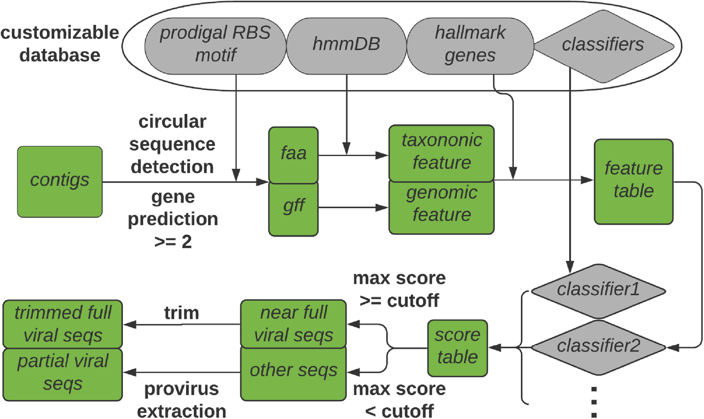
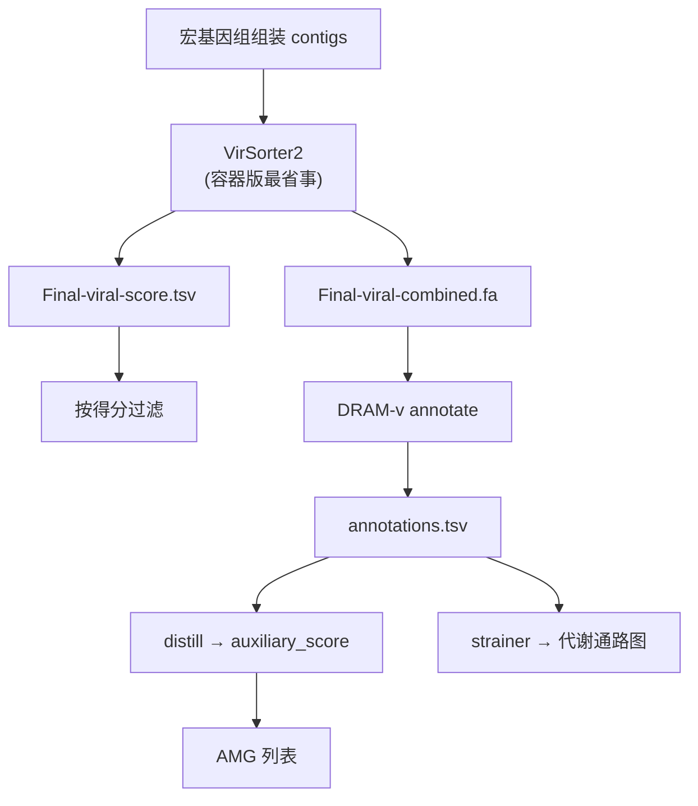

```{r include=FALSE}
Packages <- c("dplyr", "tidyr", "ggplot2")
pcutils::lib_ps(Packages)
knitr::opts_chunk$set(message = FALSE, warning = FALSE, eval = FALSE)
```

## 引言

从宏基因组中研究病毒，通常分两步：

1. **鉴定**：从宏基因组组装结果中识别出哪些序列是病毒（而不是细菌、质粒或污染）；
2. **注释**：分析这些病毒序列携带了哪些基因，特别是**辅助代谢基因（AMG, auxiliary metabolic genes）**——病毒从宿主"偷"来、在感染期间重塑宿主代谢的基因。

本文记录这条流程的两个主力工具：**VirSorter2**（鉴定）与 **DRAM-v**（注释）。


## VirSorter2



VirSorter2 是 VirSorter 的升级版，2021 年发表于 *Microbiome*。它采用**多分类器、专家指导**的方法检测多种 DNA 与 RNA 病毒基因组，相比前版有几处重要更新：

- **覆盖类群更广**：双链 DNA 噬菌体、单链 DNA 病毒、RNA 病毒、NCLDV（核质大 DNA 病毒）、Lavidaviridae（噬病毒体）；
- **机器学习驱动**：用基因组特征（结构/功能/分类注释 + 病毒标志基因）估计"病毒性"得分；
- **训练数据更好**：使用来自宏基因组等来源的高质量病毒基因组训练。

仓库：<https://github.com/jiarong/VirSorter2>

### 安装

```bash
conda create -n vs2 -c conda-forge -c bioconda virsorter=2
conda activate vs2
```

下载数据库：

```bash
# 以防之前的尝试失败，先清空
rm -rf ./virsorter_db

# 运行 setup
virsorter setup -d ./virsorter_db -j 4
```

若下载失败，可手动下载后指定路径：

```bash
# 手动下载：https://osf.io/v46sc/download
tar -xzf db.tgz
mv db virsorter_db
virsorter config --init-source --db-dir=./virsorter_db
```

> **我的踩坑经验**：在集群上用 conda 安装最后总有点问题。**官方推荐用容器版本**，这也是最省事的方式：
> ```bash
> singularity build virsorter2.sif docker://jiarong/virsorter:latest
> ```
> 得到 `virsorter2.sif` 后，它可以像普通可执行文件一样运行，而且**不需要额外下载数据库和依赖**——数据库已经打包在镜像里。

### 基本用法

```bash
# 下载官方测试数据
wget -O test.fa https://raw.githubusercontent.com/jiarong/VirSorter2/master/test/8seq.fa

# 运行
virsorter run -w test.out -i test.fa --min-length 1500 -j 4 all
```

参数说明：

| 参数 | 含义 |
|------|------|
| `-w` | 输出目录 |
| `-i` | 输入序列 |
| `--min-length` | 最短序列长度（默认 1500 bp，太短难以可靠判定） |
| `-j` | 线程数 |
| `all` | 使用全部分类器（包含所有病毒类群） |

**基于不同得分重新快速运行**（只跑 `classify` 步骤，不重跑 HMM 搜索，结果加后缀便于区分）：

```bash
# --include-groups 指定类群，--min-score 提高得分阈值
virsorter run -w test.out -i test.fa \
    --include-groups "dsDNAphage,ssDNA" -j 4 --min-score 0.9 --label rerun classify
```

**提高 HMM 搜索速度**（VirSorter2 的瓶颈在 HMM 扫描）：

```bash
virsorter config --set HMMSEARCH_THREADS=4
```

> 由于使用大型 HMM 数据库，即使是小数据集也要跑几分钟，实际项目要有心理准备。

### 输出文件解读

输出目录（`test.out`）中有三个关键文件：

| 文件 | 内容 |
|------|------|
| `Final-viral-combined.fa` | **确定的病毒序列**（下游分析的主输入） |
| `Final-viral-score.tsv` | 各病毒序列的得分表与关键特征，可用于进一步过滤 |
| `Final-viral-boundary.tsv` | 边界信息表（中间文件） |

关于 `Final-viral-boundary.tsv` 需要特别注意官方提示：

1. 与其他两个文件相比**可能有额外记录，应忽略**；
2. **不包括**带 < 2 个基因但有 ≥ 1 个标志基因的病毒序列；
3. 其中的 `group` 和 `trim_pr` 是中间结果，可能与 `Final-viral-score.tsv` 中的 `max_group`、`max_score` 不一致。

### 关于序列命名后缀

VirSorter2 会在原始序列名后加上后缀，用于区分同一 contig 中的多个病毒子序列：

| 后缀 | 含义 |
|------|------|
| `\|\|full` | 完整序列 |
| `\|\|lt2gene` | 少于 2 个基因的序列 |
| `\|\|{i}_partial` | 部分序列（第 i 个片段） |

**"完整"要打引号**。官方文档特别提醒：所谓 `full` 只是"整体上具有强病毒信号"（说"接近完整"更准确），它可能是**前病毒（provirus）**也可能是**游离病毒**。原因在于末端修剪步骤会剪掉对得分影响较小的基因（未知基因、宿主与病毒共享的基因）。因此：

- `partial` 序列可以视为前病毒（从较长的宿主序列中提取）；
- `full` 序列可能是前病毒，也可能只是从原病毒区域测序得到的短片段；
- **修剪后的"完整"序列不应被解释为前病毒**。

如果你不希望修剪 `full` 序列（留给 checkV 等专门工具判断），加 `--keep-original-seq`。

## DRAM-v：病毒序列功能注释

DRAM（Distilled and Refined Annotation of Metabolism）是微生物基因组的功能注释工具，**DRAM-v** 是它面向病毒序列的模式，专为识别 **AMG** 设计。

### 安装

```bash
git clone https://github.com/WrightonLabCSU/DRAM.git
cd DRAM

# 安装依赖（会先装一个稳定版，之后被替换）
conda env create --name my_dram_env -f environment.yaml
conda activate my_dram_env

conda install pip3
pip3 install ./
```

### 数据库准备：这一步要有耐心

> ⚠️ **重要警告**：官方的 `prepare_databases.py` 有一个已知问题——**会在最后一步报错**，而且作者没有实现断点续跑，所以出问题就得重头再来，浪费大量时间和资源。

解决办法是**先修改源码**：

```bash
vi ~/miniconda3/envs/DRAM/lib/python3.10/site-packages/mag_annotator/database_processing.py

# 找到这一行：
#   merge_files(glob(path.join(hmm_dir, 'VOG*.hmm')), vog_hmms)
# 修改为：
#   merge_files(glob(path.join(hmm_dir, 'hmm/VOG*.hmm')), vog_hmms)
```

然后再运行建库（**需要给尽可能多的内存，官方建议 500 GB**）：

```bash
DRAM-setup.py prepare_databases \
    --output_dir /share/home/jianglab/shared/pc_DB/DRAM_data
```

**时间预期**：下载步骤约 10 小时，构建数据库更久，总量 700 多 GB。这是 DRAM 最大的使用门槛。

### 已知的卡顿问题

`prepare_databases` 最后常常卡在这一步：

```text
Populating the description db, this may take some time
```

我在 HPC 上给了 **600 GB 内存、16 个 CPU**，跑了 **2 天都没完成**（估计才到 1/3），它在缓慢生成 `description_db.sqlite` 文件。

这是社区广泛吐槽的问题：<https://github.com/WrightonLabCSU/DRAM/issues/263>，但官方当时没有解决办法，建议等 2025 年的 DRAM2。

**社区 workaround**：<https://github.com/mw55309/DRAM_hacks>

> 实践建议：如果只是要做病毒 AMG 分析，可以考虑先用更轻量的注释方案（如 `dbCAN` + `KEGG` 直接注释），或使用已构建好的 DRAM 数据库镜像/共享资源，避免自己重跑一遍建库。

### 运行 DRAM-v

建库完成后，对 VirSorter2 的输出做注释：

```bash
DRAM-v.py annotate \
    -i Final-viral-combined.fa \
    -o dramv_out \
    --threads 16
```

之后可以生成汇总与代谢通路图：

```bash
# 汇总注释结果
DRAM-v.py distill -i dramv_out/annotations.tsv -o dramv_distill

# 生成 AMG 代谢通路图
DRAM-v.py strainer -i dramv_out/annotations.tsv -o dramv_strainer
```

`distill` 输出的表格中，**`auxiliary_score`** 是识别 AMG 的关键列——它综合评估该基因是否"由病毒携带而非宿主污染"，得分越低越可能是真正的 AMG。

## 完整流程与注意事项



### 注意事项

1. **`--min-length` 别设太小**：短序列的病毒判定可靠性低，默认 1500 bp 是合理起点；
2. **`full` 不等于"完整病毒基因组"**：解读时务必按官方说明谨慎处理，前病毒与游离病毒的区别影响后续分析；
3. **前病毒需要额外处理**：若要区分前病毒，需用 `checkV` 或专门的工具（如 `geNomad` 的 provirus 模式）；
4. **DRAM 建库是最大门槛**：700 GB + 数天时间，务必确认磁盘与内存充足，并先打好源码补丁；
5. **AMG 识别的假阳性**：DRAM-v 的 `auxiliary_score` 只是提示，高置信 AMG 还应结合基因组上下文（是否在病毒区域内）与文献核对；
6. **容器路径问题**：用 Singularity 时注意挂载目录，输入输出必须在挂载点内。

## 优缺点

### VirSorter2

**优点**：多分类器覆盖广（含 RNA 病毒、NCLDV）；机器学习打分比规则法更稳健；容器版部署省事；官方文档详尽。

**局限**：依赖大型 HMM 数据库，运行不快；`full` 序列的语义容易误读；对短的、碎片化的病毒序列敏感度有限。

### DRAM-v

**优点**：专为病毒 AMG 设计，`auxiliary_score` 直接可用来筛 AMG；输出包含代谢通路可视化；注释库覆盖广（KEGG、CAZy、VOG 等）。

**局限**：**建库门槛极高**（时间 + 空间）；官方脚本有已知 bug 需手动打补丁；运行内存需求大。

## 小结

从宏基因组鉴定病毒并解析其功能的标准路径是：**VirSorter2 鉴定 → 按得分过滤 → DRAM-v 注释 → 用 `auxiliary_score` 筛 AMG → 代谢通路分析**。

两个工具各有各的"坑"：VirSorter2 建议**直接用 Singularity 容器**、并正确理解 `full` / `partial` 后缀的含义；DRAM 的**建库过程是最大的门槛**，需要提前打源码补丁、准备充足资源，或寻求现成的数据库。理解这两点，能省下大量重复劳动。

## 参考文献与延伸

1. Guo, J., Bolduc, B., Zayed, A. A., et al. (2021). VirSorter2: a multi-classifier, expert-guided approach to detect diverse DNA and RNA viruses. *Microbiome*, 9, 37.
2. Shaffer, M., et al. (2020). DRAM for distilling microbial metabolism to automate the curation of microbiome function. *Nucleic Acids Research*, 48(16), 8883–8900.
3. VirSorter2 仓库：<https://github.com/jiarong/VirSorter2>
4. DRAM 仓库：<https://github.com/WrightonLabCSU/DRAM>
5. DRAM 建库问题讨论：<https://github.com/WrightonLabCSU/DRAM/issues/263>
6. 本站相关：[从宏基因组中鉴定病毒序列](../p/virus)、[宏基因组中病毒序列的宿主预测](../p/virus-host)、[VirRep: 人类肠道微生物组识别病毒新方法](../p/virrep)、[使用最新的vConTACT3进行病毒分类注释](../p/vcontact3-nat-biotechnol)
